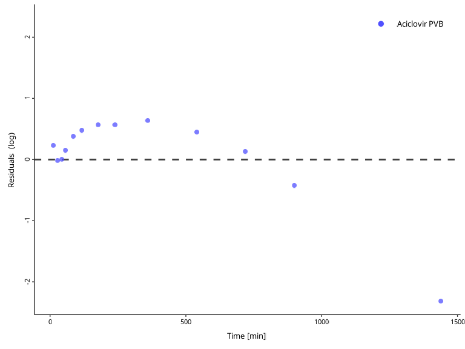

# Visualizations with \`DataCombined\`

## Introduction

You have already seen how the `DataCombined` class can be utilized to
store observed and/or simulated data (if not, read [Working with
`DataCombined`
class](https://www.open-systems-pharmacology.org/OSPSuite-R/articles/data-combined.md)).

Let’s first create a `DataCombined` object, which we will use to
demonstrate different visualizations available.

``` r
library(ospsuite)

# simulated data
simFilePath <- system.file("extdata", "Aciclovir.pkml", package = "ospsuite")
sim <- loadSimulation(simFilePath)
simResults <- runSimulations(sim)[[1]]
outputPath <- "Organism|PeripheralVenousBlood|Aciclovir|Plasma (Peripheral Venous Blood)"

# observed data
obsData <- lapply(
  c("ObsDataAciclovir_1.pkml", "ObsDataAciclovir_2.pkml", "ObsDataAciclovir_3.pkml"),
  function(x) loadDataSetFromPKML(system.file("extdata", x, package = "ospsuite"))
)
names(obsData) <- lapply(obsData, function(x) x$name)

myDataCombined <- DataCombined$new()

myDataCombined$addSimulationResults(
  simulationResults = simResults,
  quantitiesOrPaths = outputPath,
  groups = "Aciclovir PVB"
)

myDataCombined$addDataSets(
  obsData$`Vergin 1995.Iv`,
  groups = "Aciclovir PVB"
)
```

## Time profile plots

Time profile plots visualize measured or simulated values against time
and help assess if the observed data (represented by symbols and error
bars) match the simulated data (represented by lines).

``` r
plotIndividualTimeProfile(myDataCombined)
```


## Observed versus simulated scatter plot

Observed versus simulated plots allow to assess how far simulated
results are from observed values.

``` r
plotObservedVsSimulated(myDataCombined)
```


The identity line represents perfect correspondence of simulated values
with the observed ones. By default, a “two-fold” range is marked by the
dashed lines. The “x-fold” range is defined as values that are `x`-fold
higher and `1/x`-fold lower than the observed ones. The user can specify
multiple ranges by the `foldDistance` argument.

``` r
plotObservedVsSimulated(myDataCombined, foldDistance = c(1.3, 2))
```


## Residuals versus time or vs simulated scatter plot

Residual plots show if there is a systematic bias in simulated values
either in high-concentration or low-concentration regions, or,
alternatively, in early or late time periods.

``` r
plotResidualsVsSimulated(myDataCombined)
```


``` r
plotResidualsVsTime(myDataCombined)
```


Residuals of log values can be visualized with the `scaling` argument.

``` r
plotResidualsVsTime(myDataCombined, scaling = "log")
```



## Customizing plots

The look and feel for plots can be customized using the
`DefaultPlotConfiguration` class, which provides various class members
that can be used to modify the *appearance* of the plot.

``` r
myPlotConfiguration <- DefaultPlotConfiguration$new()

# Define x units
myPlotConfiguration$xUnit <- ospUnits$Time$s
# Define y units
myPlotConfiguration$yUnit <- ospUnits$`Concentration [mass]`$`µg/l`
# Change y axis scaling to logarithmic
myPlotConfiguration$yAxisScale <- tlf::Scaling$log

myPlotConfiguration$title <- "Example: Customizing a Plot"
myPlotConfiguration$subtitle <- "Using DefaultPlotConfiguration class"
myPlotConfiguration$caption <- "Source: Aciclovir data"

myPlotConfiguration$legendPosition <- tlf::LegendPositions$outsideRight
```

This configuration class can be passed to all plotting functions:

``` r
plotIndividualTimeProfile(myDataCombined, myPlotConfiguration)
```


## Creating multi-panel plots

Each of the `plotXXX()` returns a `ggplot2` object. Lets create
different plots from the same `DataCombined` and store them as
variables.

``` r
indivProfile <- plotIndividualTimeProfile(myDataCombined, myPlotConfiguration)
obsVsSim <- plotObservedVsSimulated(myDataCombined, myPlotConfiguration)
resVsSim <- plotResidualsVsSimulated(myDataCombined)
resVsTime <- plotResidualsVsTime(myDataCombined)
```

These plots can be combined into a multi-panel figure using the
`PlotGridConfiguration` and then used with
[`plotGrid()`](https://rdrr.io/pkg/tlf/man/plotGrid.html) function to
create a figure.

``` r
plotGridConfiguration <- PlotGridConfiguration$new()
plotGridConfiguration$tagLevels <- "a"
plotGridConfiguration$title <- "Multiple plots in one figure"

plotGridConfiguration$addPlots(plots = list(indivProfile, obsVsSim, resVsSim, resVsTime))

plotGrid(plotGridConfiguration)
```


The function will try to arrange the panels such that the number of rows
equals to the number of colums. You can also specify the number of rows
or columns through the `PlotGridConfiguration`:

``` r
plotGridConfiguration$nColumns <- 1

plotGrid(plotGridConfiguration)
```


Check out the documentation of the `PlotGridConfiguration` class for the
list of supported properties.

## Saving plots

All plotting functions return `ggplot` objects that can be further
modified.

To save a plot to a file, use the `ExportConfiguration` object. You can
edit various properties of the export, including the resolution, file
format, or file name.

``` r
# Create new export configuration
exportConfiguration <- tlf::ExportConfiguration$new()
# Define the path to the folder where the file will be stored
exportConfiguration$path <- "../OutputFigures"
# Define the name of the file
exportConfiguration$name <- "MultiPanelPlot"
# Resolution
exportConfiguration$dpi <- 600

# Store the plot into a variable and export it to a file
plotObject <- plotIndividualTimeProfile(myDataCombined)

exportConfiguration$savePlot(plotObject)
```

## Implementation details

All plotting functions in
[ospsuite](https://github.com/open-systems-pharmacology/ospsuite-r) make
use of the
[tlf](https://github.com/open-systems-pharmacology/tlf-library) library
to prepare visualizations. To know more about this library, see its
[website](https://www.open-systems-pharmacology.org/TLF-Library/).
