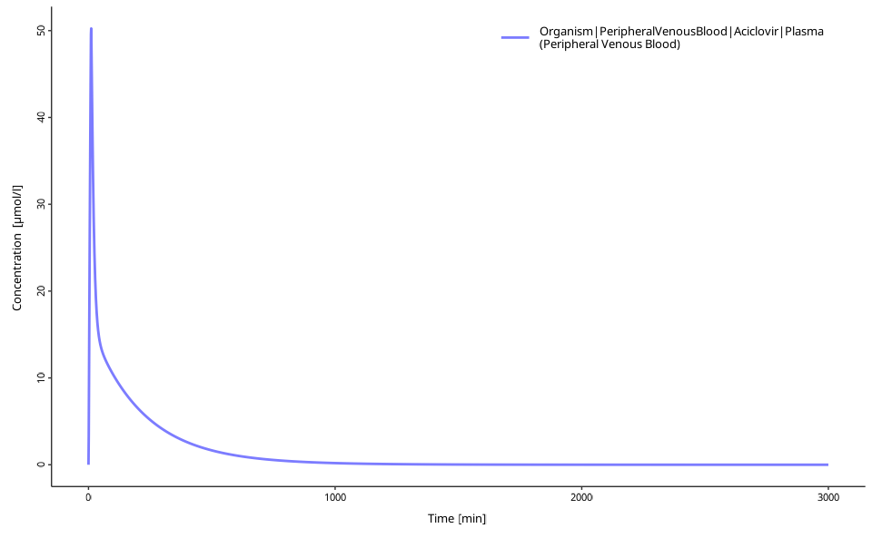
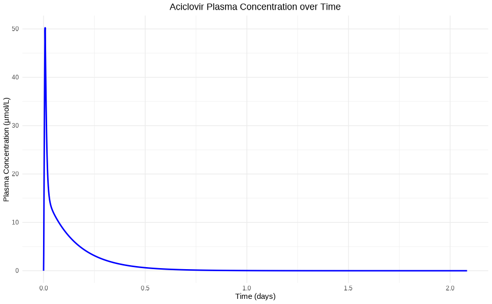
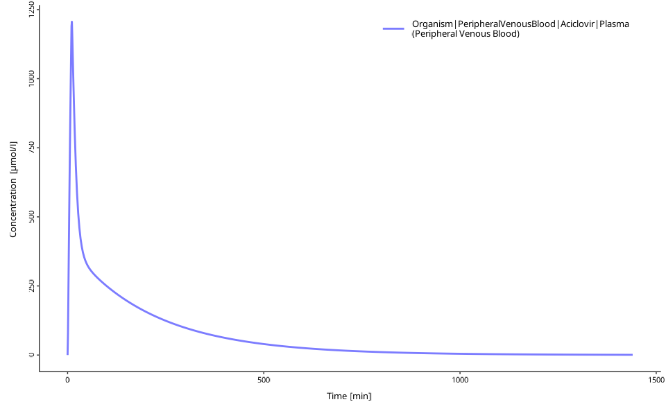

# Getting Started with ospsuite

The [ospsuite](https://github.com/open-systems-pharmacology/ospsuite-r)
R-package is part of the [Open Systems
Pharmacology](http://www.open-systems-pharmacology.org/) Software
(OSPS), an open-source suite of modeling and simulation tools for
pharmaceutical and other life-sciences applications. This package
provides the functionality of loading, manipulating, and simulating the
simulations created in the software tools PK-Sim and MoBi.

This guide demonstrates how to load, run, and visualize PBPK simulations
using practical examples.

## Overview

This tutorial covers:

- Loading and running PBPK simulations
- Exploring and modifying model parameters  
- Visualizing simulation results
- Understanding the basic ospsuite workflow

All examples in this tutorial and the rest of the documentation use the
Aciclovir example model (unless stated otherwise), which is included in
the package and can be accessed with:

``` r
system.file("extdata", "Aciclovir.pkml", package = "ospsuite")
```

## Quick Start: Basic Simulation

This example demonstrates the essential ospsuite workflow. Detailed
explanations follow in subsequent sections.

``` r
# Load the ospsuite package
library(ospsuite)

# Load the built-in example simulation
simFilePath <- system.file("extdata", "Aciclovir.pkml", package = "ospsuite")
sim <- loadSimulation(simFilePath)

# Run the simulation
results <- runSimulations(sim)

# Create a quick visualization
myDataCombined <- DataCombined$new()
myDataCombined$addSimulationResults(results[[1]])
plotIndividualTimeProfile(dataCombined = myDataCombined)
```


This example loads, runs, and visualizes a PBPK simulation. The plot
shows the concentration-time profile for Aciclovir in plasma after IV
administration.

## Step-by-Step Tutorial

The following sections detail each workflow step and demonstrate
ospsuite capabilities.

### Loading Simulations

Simulations require a **.pkml** format file (exported from PK-Sim or
MoBi):

``` r
# Using the included example
simFilePath <- system.file("extdata", "Aciclovir.pkml", package = "ospsuite")
sim <- loadSimulation(simFilePath)

# For custom files, use:
# sim <- loadSimulation("path/to/simulation.pkml")

# Explore the simulation
print(sim)
#> <Simulation>
#>   • Name: Vergin 1995 IV
#>   • Source file:
#>   /home/runner/.cache/R/renv/library/OSPSuite-R-d4dfdcc6/linux-ubuntu-noble/R-4.5/x86_64-pc-linux-gnu/ospsuite/extdata/Aciclovir.pkml
```

### Exploring Model Structure

After loading, explore the simulation structure and parameters:

``` r
# Get the simulation tree structure
simTree <- getSimulationTree(sim)

# Explore parameter paths
simTree$Organism$Weight$path
#> [1] "Organism|Weight"

# Find parameters using wildcards
getAllParametersMatching("**|Dose*", sim)
#> [[1]]
#> <Parameter>
#>   • Quantity Type: Parameter
#>   • Path: Applications|IV 250mg 10min|Application_1|ProtocolSchemaItem|Dose
#>   • Value: 2.50e-04 [kg]
#> 
#> ── Formula ──
#> 
#>   • isConstant: TRUE
#> 
#> [[2]]
#> <Parameter>
#>   • Quantity Type: Parameter
#>   • Path: Applications|IV 250mg
#>   10min|Application_1|ProtocolSchemaItem|DosePerBodySurfaceArea
#>   • Value: 0.00e+00 [kg/dm²]
#> 
#> ── Formula ──
#> 
#>   • isConstant: TRUE
#> 
#> [[3]]
#> <Parameter>
#>   • Quantity Type: Parameter
#>   • Path: Applications|IV 250mg
#>   10min|Application_1|ProtocolSchemaItem|DosePerBodyWeight
#>   • Value: 0.00e+00 [kg/kg]
#> 
#> ── Formula ──
#> 
#>   • isConstant: TRUE

# Or search for specific terms
grep("Dose", getAllParameterPathsIn(container = sim), value = TRUE)
#> [1] "Applications|IV 250mg 10min|Application_1|ProtocolSchemaItem|Dose"                  
#> [2] "Applications|IV 250mg 10min|Application_1|ProtocolSchemaItem|DosePerBodySurfaceArea"
#> [3] "Applications|IV 250mg 10min|Application_1|ProtocolSchemaItem|DosePerBodyWeight"
```

**Note:** Parameter paths in ospsuite match those displayed in PK-Sim or
MoBi. Starting with MoBi 12.0, parameter paths can be copied by
right-clicking the parameter in the simulation tree and selecting “Copy
Path”.

### Modifying Parameters

Retrieve and modify parameter values:

``` r
# Get a specific parameter
dose <- getParameter(
  path = "Applications|IV 250mg 10min|Application_1|ProtocolSchemaItem|Dose",
  sim
)
print(dose)
#> <Parameter>
#>   • Quantity Type: Parameter
#>   • Path: Applications|IV 250mg 10min|Application_1|ProtocolSchemaItem|Dose
#>   • Value: 2.50e-04 [kg]
#> 
#> ── Formula ──
#> 
#>   • isConstant: TRUE

# Change the dose value
setParameterValues(dose, 0.004) # New dose: 4 mg/kg
print(dose)
#> <Parameter>
#>   • Quantity Type: Parameter
#>   • Path: Applications|IV 250mg 10min|Application_1|ProtocolSchemaItem|Dose
#>   • Value: 4.00e-03 [kg]
#> 
#> ── Formula ──
#> 
#>   • isConstant: TRUE

# Scale a parameter by a factor
scaleParameterValues(dose, factor = 2) # Double the dose
print(dose)
#> <Parameter>
#>   • Quantity Type: Parameter
#>   • Path: Applications|IV 250mg 10min|Application_1|ProtocolSchemaItem|Dose
#>   • Value: 8.00e-03 [kg]
#> 
#> ── Formula ──
#> 
#>   • isConstant: TRUE

# Reset to original value
dose$reset()
print(dose)
#> <Parameter>
#>   • Quantity Type: Parameter
#>   • Path: Applications|IV 250mg 10min|Application_1|ProtocolSchemaItem|Dose
#>   • Value: 2.50e-04 [kg]
#> 
#> ── Formula ──
#> 
#>   • isConstant: TRUE
```

### Customizing Simulation Settings

Adjust simulation outputs and solver settings:

``` r

# Originally, the simulation outputs plasma concentrations
sim$outputSelections
#> <OutputSelections>
#>   • Organism|PeripheralVenousBlood|Aciclovir|Plasma (Peripheral Venous Blood):
#>   Drug, Observer

# Add new outputs to track
addOutputs(c("Organism|Lumen|Stomach|Aciclovir"), simulation = sim)

# Now, the simulation will compute two outputs
sim$outputSelections
#> <OutputSelections>
#>   • Organism|PeripheralVenousBlood|Aciclovir|Plasma (Peripheral Venous Blood):
#>   Drug, Observer
#>   • Organism|Lumen|Stomach|Aciclovir: Drug

# Adjust solver precision if needed
sim$solver$absTol <- 1e-12
sim$solver$relTol <- 1e-8

# Add custom output intervals for higher resolution
addOutputInterval(
  simulation = sim,
  startTime = 1440, # 1 day
  endTime = 3000, # ~2 days
  resolution = 10, # Every 10 minutes
  intervalName = "highRes"
)

# Check current output schema
print(sim$outputSchema)
#> <OutputSchema>
#> 
#> ── Output intervals ──
#> 
#> <Interval>
#>   • Name: Simulation interval high resolution
#>   • Start time: 0.00e+00 [min]
#>   • End time: 15.00 [min]
#>   • Resolution: 1.00 [pts/min]
#> <Interval>
#>   • Name: Simulation Interval 1
#>   • Start time: 15.00 [min]
#>   • End time: 1440.00 [min]
#>   • Resolution: 0.33 [pts/min]
#> <Interval>
#>   • Name: Simulation Interval 2
#>   • Start time: 120.00 [min]
#>   • End time: 1440.00 [min]
#>   • Resolution: 0.07 [pts/min]
#> <Interval>
#>   • Name: highRes
#>   • Start time: 1440.00 [min]
#>   • End time: 3000.00 [min]
#>   • Resolution: 10.00 [pts/min]
```

### Running Simulations

After setting parameters, run the simulation:

``` r
# Run the simulation
results <- runSimulations(sim)

# Examine the results structure
print(results[[1]])
#> <SimulationResults>
#>   • Number of individuals: 1
#> For paths:
#>   • Organism|Lumen|Stomach|Aciclovir
#>   • Organism|PeripheralVenousBlood|Aciclovir|Plasma (Peripheral Venous Blood)

# Extract specific concentration-time data
plasmaConc <- results[[1]]$getValuesByPath(
  "Organism|PeripheralVenousBlood|Aciclovir|Plasma (Peripheral Venous Blood)",
  individualIds = 0
)
head(plasmaConc)
#> [1]  0.000000  3.254671  9.100439 15.016583 20.726168 26.201170
```

### Visualizing Results

ospsuite provides multiple visualization options:

#### Option 1: Built-in Plotting Functions

``` r
# Create a DataCombined object for plotting
myDataCombined <- DataCombined$new()
myDataCombined$addSimulationResults(
  results[[1]],
  quantitiesOrPaths = "Organism|PeripheralVenousBlood|Aciclovir|Plasma (Peripheral Venous Blood)"
)

# Convert to data frame if needed
df_results <- myDataCombined$toDataFrame()
head(df_results)
#> # A tibble: 6 × 12
#>   IndividualId xValues name  yValues xDimension xUnit yDimension yUnit molWeight
#>          <int>   <dbl> <chr>   <dbl> <chr>      <chr> <chr>      <chr>     <dbl>
#> 1            0       0 Orga…    0    Time       min   Concentra… µmol…      225.
#> 2            0       1 Orga…    3.25 Time       min   Concentra… µmol…      225.
#> 3            0       2 Orga…    9.10 Time       min   Concentra… µmol…      225.
#> 4            0       3 Orga…   15.0  Time       min   Concentra… µmol…      225.
#> 5            0       4 Orga…   20.7  Time       min   Concentra… µmol…      225.
#> 6            0       5 Orga…   26.2  Time       min   Concentra… µmol…      225.
#> # ℹ 3 more variables: dataType <chr>, yErrorValues <dbl>, group <chr>

# Create publication-ready plots
plotIndividualTimeProfile(dataCombined = myDataCombined)
```



#### Option 2: Custom Plotting with ggplot2

``` r
library(ggplot2)

# Transform simulation results to a dataframe
results_df <- simulationResultsToDataFrame(
  results[[1]],
  quantitiesOrPaths = "Organism|PeripheralVenousBlood|Aciclovir|Plasma (Peripheral Venous Blood)"
)

results_df$Time <- results_df$Time / (60 * 24) # Convert to days

ggplot(results_df, aes(x = Time, y = simulationValues)) +
  geom_line(color = "blue", size = 1) +
  labs(
    title = "Aciclovir Plasma Concentration over Time",
    x = "Time (days)",
    y = "Plasma Concentration (µmol/L)"
  ) +
  theme_minimal() +
  theme(plot.title = element_text(hjust = 0.5))
```



## Complete Workflow Example

This complete example demonstrates the typical ospsuite workflow:

``` r
# 1. Load simulation
simFilePath <- system.file("extdata", "Aciclovir.pkml", package = "ospsuite")
sim <- loadSimulation(simFilePath)

# 2. Modify parameters (e.g., change dose)
dose <- getParameter(
  path = "Applications|IV 250mg 10min|Application_1|ProtocolSchemaItem|Dose",
  sim
)
setParameterValues(dose, 0.006) # 6 mg/kg dose

# 3. Run simulation
results <- runSimulations(sim)

# 4. Visualize results
myDataCombined <- DataCombined$new()
myDataCombined$addSimulationResults(results[[1]])
plotIndividualTimeProfile(dataCombined = myDataCombined)
```



``` r

# 5. Extract data for further analysis
df_results <- myDataCombined$toDataFrame()
print(paste("Peak concentration:", round(max(df_results$yValues), 2), "µmol/L"))
#> [1] "Peak concentration: 1206.07 µmol/L"
```

## Understanding ospsuite Objects

This section explains the key concepts and object structure in ospsuite.

### Object-Oriented Approach

The [ospsuite](https://github.com/open-systems-pharmacology/ospsuite-r)
R-package utilizes object-oriented (OO) programming based on the [R6
system](https://adv-r.hadley.nz/r6.html). The package offers a
functional programming workflow familiar to R users, but understanding
basic OO concepts improves effectiveness.

Most functions return an *instance* (or *object*) of a *class*. These
objects have properties and methods accessible with the `$` sign:

``` r
# Creating an object
myData <- DataCombined$new()

# Accessing a property
simulationName <- myData$name

# Calling a method
myData$addSimulationResults(results[[1]])
```

Call `print(object)` to display detailed information about any object.

### Key Classes

Understanding these main classes improves workflow effectiveness:

**Simulation Objects:**

- **`Simulation`**: Your loaded PBPK model from the .pkml file
- **`SimulationResults`**: Output from running simulations
- **`SimulationRunOptions`**: Controls for how simulations run (cores,
  error checking, progress bars)

**Model Structure:**

- **`Entity`**: Any part of the model (parameters, molecules,
  containers)
- **`Container`**: Model compartments that contain other entities
  (organs, compartments)
- **`Quantity`**: Entities with values (Parameters and Molecules)
- **`Parameter`**: Model parameters you can modify
- **`Molecule`**: Drug molecules and their concentrations

**Results and Analysis:**

- **`DataCombined`**: Container for combining simulation results and
  observed data
- **`SimulationPKAnalyses`**: PK parameter calculations (AUC, Cmax,
  etc.)
- **`Population`**: Virtual population data for population simulations

**Configuration:**

- **`OutputSchema`**: Defines when simulation results are saved
- **`OutputSelections`**: Which quantities to include in results
- **`SolverSettings`**: Numerical solver configuration

## General Workflow Summary

The typical ospsuite workflow follows these steps:

1.  **Load simulation** from .pkml file
2.  **Explore entities** (parameters, molecules, containers)
3.  **Modify values** (parameter values, initial concentrations)
4.  **Configure outputs** (what to track, when to save results)
5.  **Run simulation**
6.  **Analyze results** (extract data, calculate PK parameters)
7.  **Visualize** (built-in plots or custom graphics)

## Next Steps

After mastering the basics, explore these advanced topics:

### Essential Next Steps:

- **[Loading a simulation and accessing
  entities](https://www.open-systems-pharmacology.org/OSPSuite-R/articles/load-get.md)** -
  Deep dive into model exploration
- **[Changing parameter and molecule start
  values](https://www.open-systems-pharmacology.org/OSPSuite-R/articles/set-values.md)** -
  Advanced parameter manipulation
- **[Table
  parameters](https://www.open-systems-pharmacology.org/OSPSuite-R/articles/table-parameters.md)** -
  Working with parameter tables and bulk operations
- **[Running a
  simulation](https://www.open-systems-pharmacology.org/OSPSuite-R/articles/run-simulation.md)** -
  Simulation options and batch processing

### Population Studies:

- **[Creating
  individuals](https://www.open-systems-pharmacology.org/OSPSuite-R/articles/create-individual.md)** -
  Virtual patient creation
- **[Population
  simulations](https://www.open-systems-pharmacology.org/OSPSuite-R/articles/create-run-population.md)** -
  Large-scale population PK/PD

### Analysis and Optimization:

- **[PK
  Analysis](https://www.open-systems-pharmacology.org/OSPSuite-R/articles/pk-analysis.md)** -
  Calculate pharmacokinetic parameters
- **[Sensitivity
  analysis](https://www.open-systems-pharmacology.org/OSPSuite-R/articles/sensitivity-analysis.md)** -
  Parameter importance analysis

### Data Integration:

- **[Working with observed
  data](https://www.open-systems-pharmacology.org/OSPSuite-R/articles/observed-data.md)** -
  Import experimental data
- **[DataCombined
  workflows](https://www.open-systems-pharmacology.org/OSPSuite-R/articles/data-combined.md)** -
  Combine simulations with observations
- **[Visualizations with
  DataCombined](https://www.open-systems-pharmacology.org/OSPSuite-R/articles/data-combined-plotting.md)** -
  Advanced plotting with DataCombined objects

### Advanced Topics:

- **[Efficient
  calculations](https://www.open-systems-pharmacology.org/OSPSuite-R/articles/efficient-calculations.md)** -
  Performance optimization
- **[Dimensions and
  Units](https://www.open-systems-pharmacology.org/OSPSuite-R/articles/unit-conversion.md)** -
  Unit conversion and validation

## General Information

In order to load a simulation in R, it must be present in the
**\*.pkml** file format. Every simulation in PK-Sim or MoBi can be
exported to the \*.pkml format. Unless otherwise stated, the examples
shown in the vignettes are based on the Aciclovir example model, which
can be found in the PK-Sim examples folder of your OSPS installation.

**Important Notes:**

- Parameter paths in ospsuite exactly match those in PK-Sim/MoBi
- You cannot add new model structure (like new administrations) - only
  modify existing parameters
- For complex dosing regimens, create them in PK-Sim/MoBi first, then
  modify in R
- Simulation files (.pkml) contain the complete model structure and
  cannot be modified structurally in R

For detailed exploration of model structure and parameter access, see
**[Loading a simulation and accessing
entities](https://www.open-systems-pharmacology.org/OSPSuite-R/articles/load-get.md)**.
