# Plotting with ospsuite.plots

## Introduction

The [ospsuite](https://github.com/open-systems-pharmacology/ospsuite-r)
package provides a set of plotting functions based on the
[ospsuite.plots](https://www.open-systems-pharmacology.org/OSPSuite.Plots/)
library. These functions are designed to work seamlessly with
`DataCombined` objects and provide advanced visualization capabilities
for pharmacometric data analysis.

This vignette describes the exported plotting functions from the
`plot-with-ospsuite-plots.R` file:

- [`plotTimeProfile()`](https://www.open-systems-pharmacology.org/OSPSuite-R/reference/plotTimeProfile.md) -
  Creates time profile plots
- [`plotPredictedVsObserved()`](https://www.open-systems-pharmacology.org/OSPSuite-R/reference/plotPredictedVsObserved.md) -
  Creates predicted vs observed scatter plots
- [`plotResidualsVsCovariate()`](https://www.open-systems-pharmacology.org/OSPSuite-R/reference/plotResidualsVsCovariate.md) -
  Creates residual plots against time, observed, or predicted values
- [`plotResidualsAsHistogram()`](https://www.open-systems-pharmacology.org/OSPSuite-R/reference/plotResidualsAsHistogram.md) -
  Creates histogram plots of residuals
- [`plotQuantileQuantilePlot()`](https://www.open-systems-pharmacology.org/OSPSuite-R/reference/plotQuantileQuantilePlot.md) -
  Creates Q-Q plots for assessing residual distribution

All these functions return `ggplot2` objects that can be further
customized and saved.

For more information on the underlying library: -
[ospsuite.plots](https://www.open-systems-pharmacology.org/OSPSuite.Plots/):
[GitHub
repository](https://github.com/Open-Systems-Pharmacology/OSPSuite.Plots)

## Initial Setup

Before creating plots with `ospsuite.plots`, it’s important to
initialize the plotting environment properly. This involves two key
steps:

1.  **Set default plotting options** using
    [`ospsuite.plots::setDefaults()`](https://www.open-systems-pharmacology.org/OSPSuite.Plots/reference/setDefaults.html)
2.  **Configure the watermark option** using
    `options(ospsuite.plots.watermarkEnabled = TRUE)` or
    `options(ospsuite.plots.watermarkEnabled = FALSE)`

``` r
library(ospsuite)

# Set default plotting options for ospsuite.plots
# Note: ospsuite.plots is imported by ospsuite, so we use :: for clarity
ospsuite.plots::setDefaults()

# Enable watermark for plots (optional)
options(ospsuite.plots.watermarkEnabled = TRUE)
```

The `setDefaults()` function initializes various plotting defaults that
ensure consistent appearance across all plots. The watermark option
allows you to add a watermark to your plots.  
Refer to the
[ospsuite.plots](https://www.open-systems-pharmacology.org/OSPSuite.Plots/)
package documentation for details.

## Setting up the data

Next, let’s create `DataCombined` objects that we will use throughout
this vignette:

``` r
# Load simulation
simFilePath <- system.file("extdata", "Aciclovir.pkml", package = "ospsuite")
sim <- loadSimulation(simFilePath)
# simulate with two outputs
addOutputs(
  quantitiesOrPaths = "Organism|Kidney|Urine|Aciclovir|Fraction excreted to urine",
  simulation = sim
)
simResults <- runSimulations(sim)[[1]]

# Load observed data
obsData <- loadDataSetFromPKML(system.file(
  "extdata",
  "ObsDataAciclovir_1.pkml",
  package = "ospsuite"
))

# Create DataCombined object
myDataCombined <- DataCombined$new()

myDataCombined$addSimulationResults(
  simulationResults = simResults,
  quantitiesOrPaths = "Organism|PeripheralVenousBlood|Aciclovir|Plasma (Peripheral Venous Blood)",
  names = list(
    "Organism|PeripheralVenousBlood|Aciclovir|Plasma (Peripheral Venous Blood)" = "Plasma"
  ),
  groups = "Aciclovir PVB"
)

myDataCombined$addDataSets(
  obsData,
  groups = "Aciclovir PVB"
)

# Create DataCombined object with more than one simulation result and observed data set
myDataCombinedMulti <- DataCombined$new()

myDataCombinedMulti$addSimulationResults(
  simulationResults = simResults,
  names = list(
    "Organism|PeripheralVenousBlood|Aciclovir|Plasma (Peripheral Venous Blood)" = "Plasma (Peripheral Venous Blood) ",
    "Organism|Kidney|Urine|Aciclovir|Fraction excreted to urine" = "fraction excreted"
  ),
  groups = "Aciclovir"
)

myDataCombinedMulti$addDataSets(
  obsData,
  groups = "Aciclovir"
)

obsDataUrine <- DataSet$new(name = 'urine data')
obsDataUrine$yDimension <- "Fraction"
obsDataUrine$yUnit <- ""

obsDataUrine$setValues(
  xValues = c(3, 12, 24),
  yValues = c(0.5, 0.9, 0.98),
  yErrorValues = NULL
)

myDataCombinedMulti$addDataSets(
  obsDataUrine,
  groups = "Aciclovir"
)
```

### Population Simulation Data

For demonstrating population-specific features, let’s also create a
`DataCombined` object with population simulation results:

``` r
# Load population from CSV file
popFilePath <- system.file("extdata", "pop.csv", package = "ospsuite")
population <- loadPopulation(csvPopulationFile = popFilePath)

# Run population simulation
popResults <- runSimulations(simulations = sim, population = population)[[1]]

# Create DataCombined object for population
myPopDataCombined <- DataCombined$new()

myPopDataCombined$addSimulationResults(
  simulationResults = popResults,
  quantitiesOrPaths = "Organism|PeripheralVenousBlood|Aciclovir|Plasma (Peripheral Venous Blood)",
  names = list(
    "Organism|PeripheralVenousBlood|Aciclovir|Plasma (Peripheral Venous Blood)" = "Plasma"
  ),
  groups = "Aciclovir Population"
)

myPopDataCombined$addDataSets(
  obsData,
  groups = "Aciclovir Population"
)
```

## Time Profile Plots

The
[`plotTimeProfile()`](https://www.open-systems-pharmacology.org/OSPSuite-R/reference/plotTimeProfile.md)
function creates time profile plots showing observed and simulated data
over time. This is one of the most common visualizations in
pharmacometric analysis.

``` r
plotTimeProfile(myDataCombined)
```

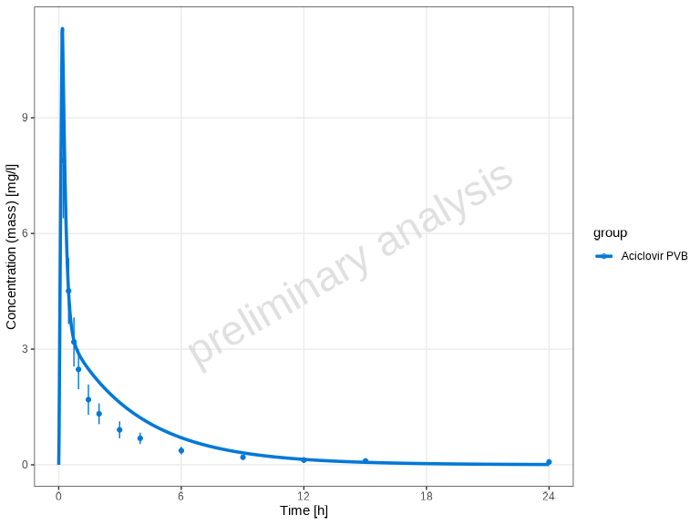

### Population Data Aggregation

When working with population simulations, you can control how the data
is aggregated using the `aggregation` parameter. Options include:

- `"quantiles"` (default) - Shows median and specified quantiles
- `"arithmetic"` - Shows arithmetic mean with standard deviations
- `"geometric"` - Shows geometric mean with standard deviations

Here’s an example using the population simulation data:

``` r
# Plot population data with default quantile aggregation
plotTimeProfile(myPopDataCombined, yScale = 'log')
```

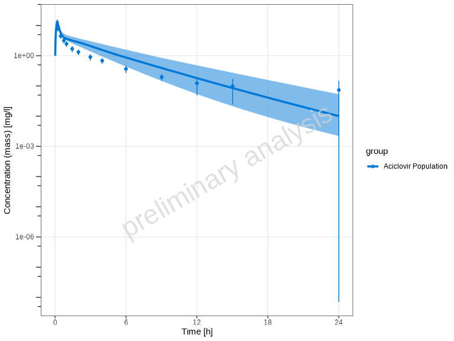

You can customize the quantiles:

``` r
plotTimeProfile(
  myPopDataCombined,
  yScale = 'log',
  aggregation = "quantiles",
  quantiles = c(0.1, 0.5, 0.9)
)
```

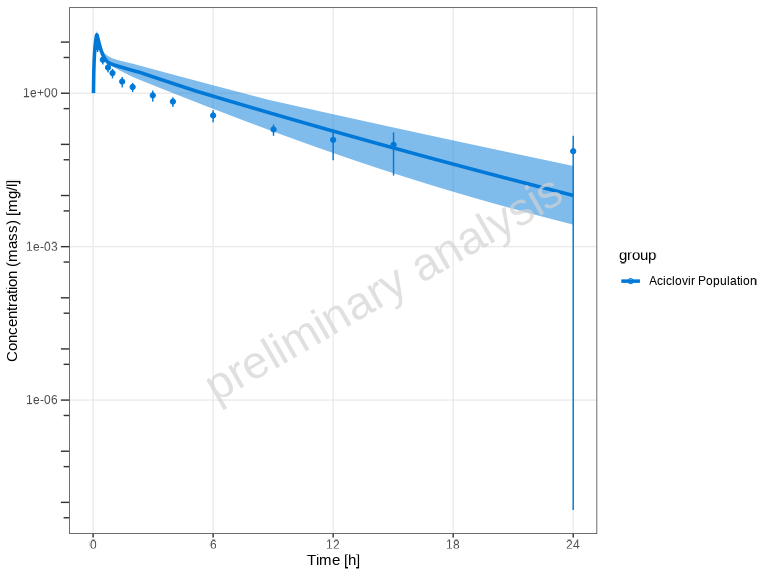

Alternatively, you can use arithmetic mean aggregation with standard
deviation bands:

``` r
plotTimeProfile(
  myPopDataCombined,
  yScale = 'log',
  aggregation = "arithmetic",
  nsd = 1
)
```

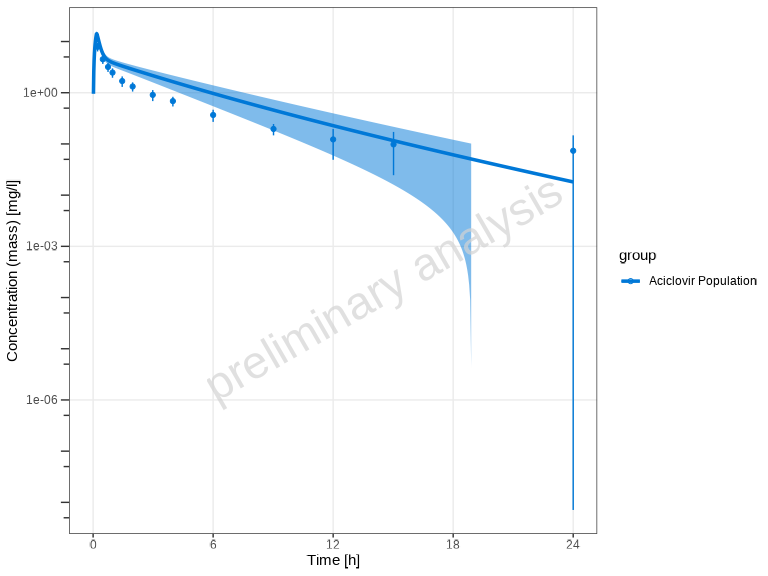

### Showing Individual Dataset Names

By default, the legend is created using the `group` variable of the
`DataCombined` object.

For datasets with multiple observed or simulated results, you can
display individual dataset names in the legend using the
`showLegendPerDataset` parameter.

``` r
# No per-dataset differentiation (default)
plotTimeProfile(myDataCombinedMulti, showLegendPerDataset = "none")
```

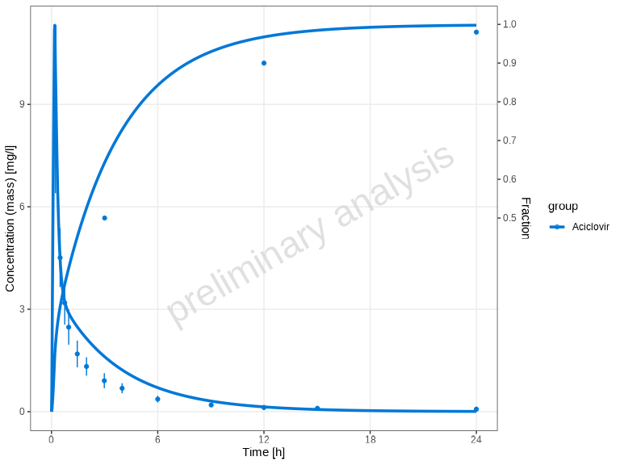

``` r

# Show all individual dataset names (both observed and simulated)
plotTimeProfile(myDataCombinedMulti, showLegendPerDataset = "all")
```

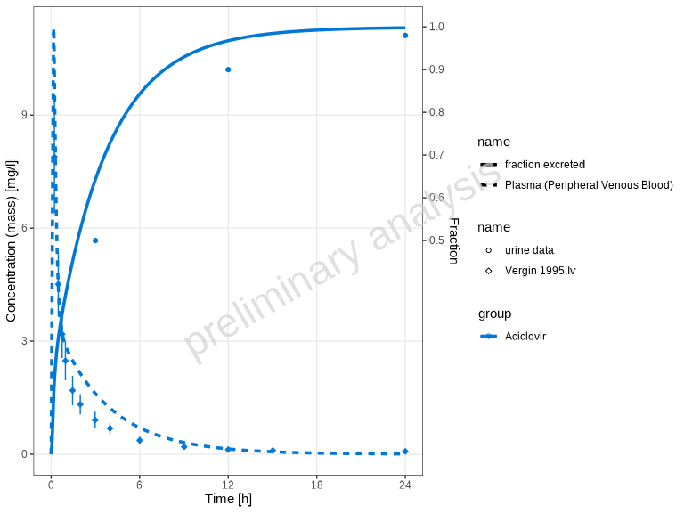

``` r

# Show only observed dataset names (different shapes)
plotTimeProfile(myDataCombinedMulti, showLegendPerDataset = "observed")
```

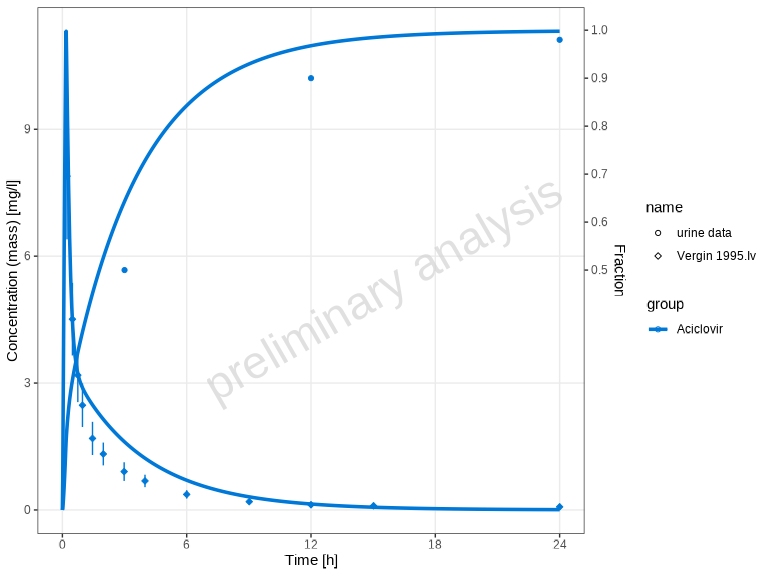

``` r

# Show only simulated dataset names (different line types)
plotTimeProfile(myDataCombinedMulti, showLegendPerDataset = "simulated")
```

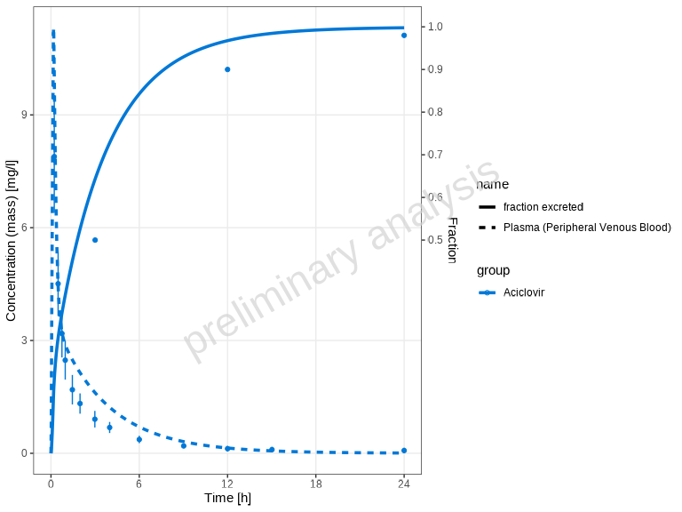

### Custom Aesthetic Mappings

For manual control over aesthetics, use the `mapping` and
`observedMapping` parameters.

**Important**: The aesthetic used for differentiation depends on data
type: - **Observed data** (points): Uses different **shapes**
(`shape = name`) - **Simulated data** (lines): Uses different **line
types** (`linetype = name`)

- The default of `observedMapping` is a copy of mapping.

To get the same plots as above you have to set the aesthetics as
following:

``` r
# Show all individual dataset names (both observed and simulated)
plotTimeProfile(
  myDataCombinedMulti,
  mapping = ggplot2::aes(linetype = name),
  observedMapping = ggplot2::aes(shape = name)
)

# Show only observed dataset names (different shapes)
plotTimeProfile(
  myDataCombinedMulti,
  observedMapping = ggplot2::aes(shape = name)
)

# Show only simulated dataset names (different line types)
plotTimeProfile(
  myDataCombinedMulti,
  mapping = ggplot2::aes(linetype = name),
  observedMapping = ggplot2::aes()
)
```

You can further customize the plot appearance using `ggplot2` aesthetic
mappings and all columns available in
`myDataCombinedMulti$toDataFrame()`.

``` r
# Customize aesthetics
plotTimeProfile(
  myDataCombinedMulti,
  mapping = ggplot2::aes(color = yDimension, fill = yDimension)
)
```

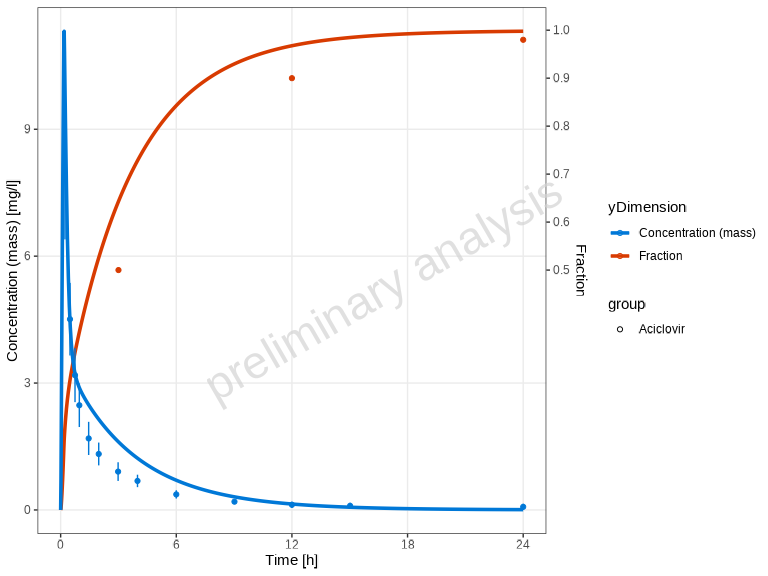

## Predicted vs Observed Plots

Beyond time profiles, you can assess model performance using
goodness-of-fit plots. The
[`plotPredictedVsObserved()`](https://www.open-systems-pharmacology.org/OSPSuite-R/reference/plotPredictedVsObserved.md)
function creates scatter plots comparing predicted (simulated) values to
observed values. This helps assess model performance and identify
systematic biases.

``` r
plotPredictedVsObserved(myDataCombined)
```

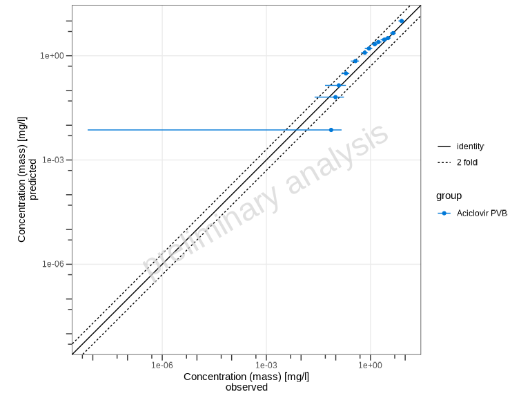

By default, the plot shows: - Identity line (perfect agreement) -
Fold-distance lines (default: 2-fold range)

### Customizing Fold Distance

You can customize the fold-distance lines using the
`comparisonLineVector` parameter:

``` r
# Show 1.5-fold and 3-fold ranges
plotPredictedVsObserved(
  myDataCombined,
  comparisonLineVector = ospsuite.plots::getFoldDistanceList(folds = c(1.5, 3))
)
```

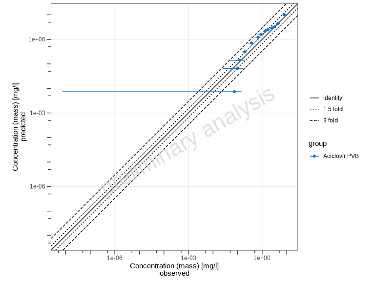

### Swapping Axes

By default, predicted values are on the y-axis and observed on the
x-axis. You can swap these using the `predictedAxis` parameter:

``` r
# Put predicted on x-axis, observed on y-axis
plotPredictedVsObserved(myDataCombined, predictedAxis = "x")
```

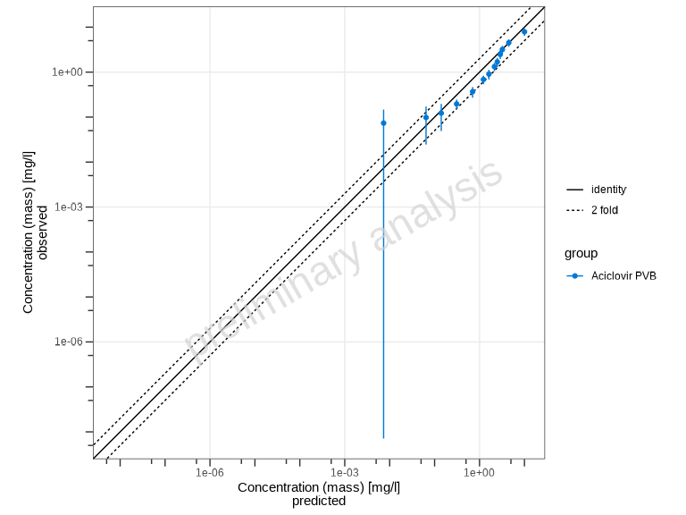

### Scaling Options

The `xyScale` parameter controls the axis scaling:

``` r
# Use linear scale instead of log
plotPredictedVsObserved(myDataCombined, xyScale = "linear")
```

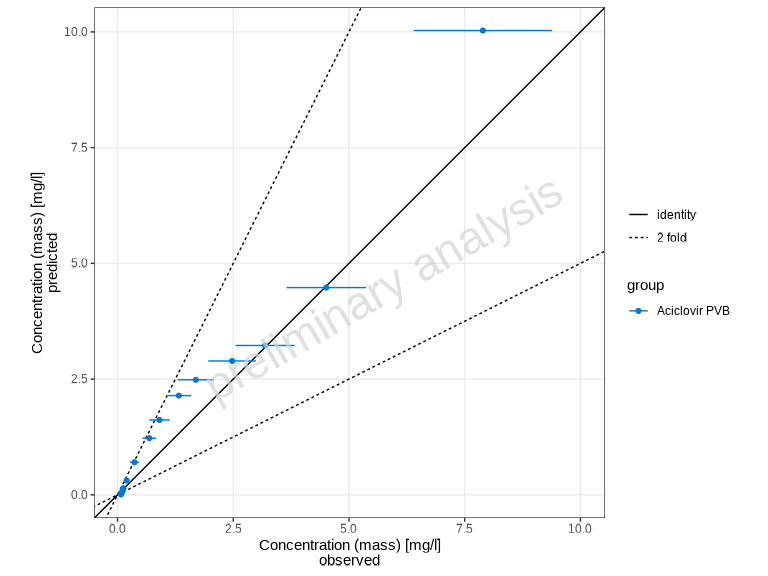

## Residuals vs Covariate Plots

The
[`plotResidualsVsCovariate()`](https://www.open-systems-pharmacology.org/OSPSuite-R/reference/plotResidualsVsCovariate.md)
function creates residual plots to assess systematic bias in the model.
You can plot residuals against time, observed values, or predicted
values.

### Residuals vs Observed Values

``` r
plotResidualsVsCovariate(myDataCombined, xAxis = "observed")
```

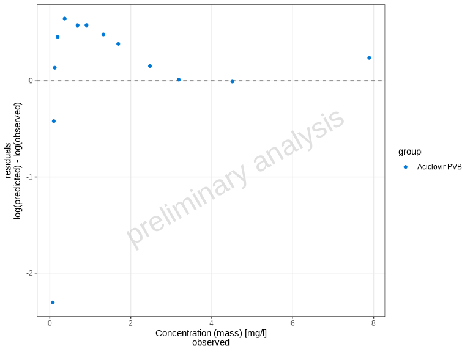

### Residuals vs Time

``` r
plotResidualsVsCovariate(myDataCombined, xAxis = "time")
```

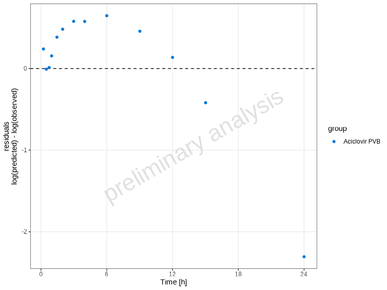

### Residuals vs Predicted Values

``` r
plotResidualsVsCovariate(myDataCombined, xAxis = "predicted")
```

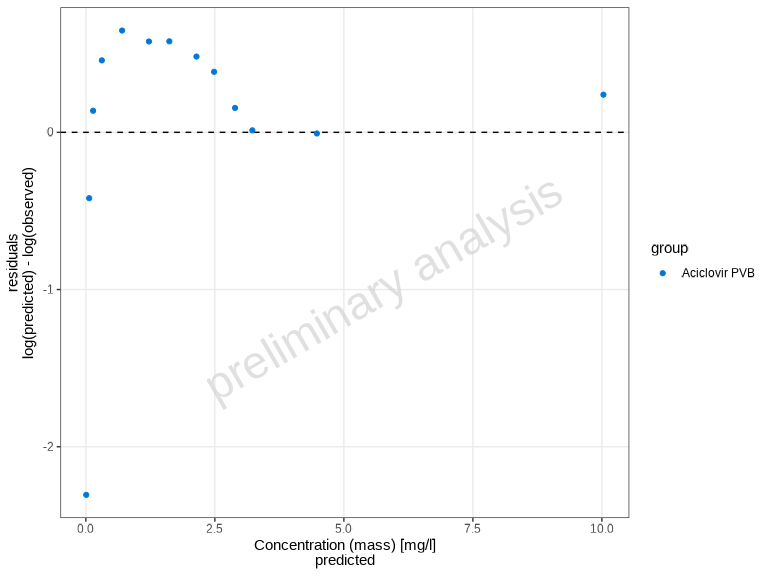

### Residual Scale Options

The `residualScale` parameter controls how residuals are calculated and
displayed (this same parameter is used in `plotResidualsAsHistogram` and
`plotQuantileQuantilePlot`):

- `"log"` (default) - Logarithmic residuals: `log(observed/predicted)`
- `"linear"` - Linear residuals: `observed - predicted`
- `"ratio"` - Ratio: `observed/predicted`

``` r
# Use linear residuals
plotResidualsVsCovariate(
  myDataCombined,
  xAxis = "observed",
  residualScale = "linear"
)
```

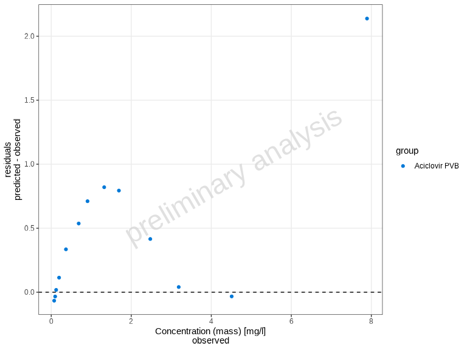

## Residuals as Histogram

The
[`plotResidualsAsHistogram()`](https://www.open-systems-pharmacology.org/OSPSuite-R/reference/plotResidualsAsHistogram.md)
function creates a histogram of residuals, which helps assess the
distribution of errors.

``` r
plotResidualsAsHistogram(myDataCombined)
```

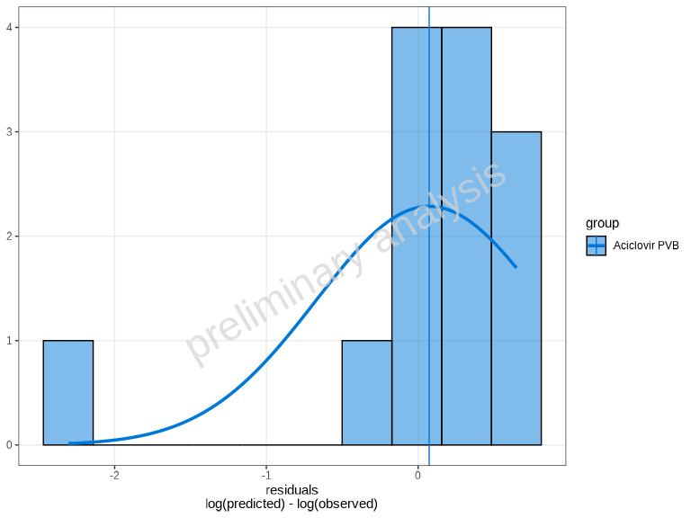

By default, a normal distribution overlay is added to help assess
normality. You can control this using the `distribution` parameter:

``` r
# Without distribution overlay
plotResidualsAsHistogram(myDataCombined, distribution = 'none')
```

The `residualScale` parameter works the same as in
[`plotResidualsVsCovariate()`](https://www.open-systems-pharmacology.org/OSPSuite-R/reference/plotResidualsVsCovariate.md):

``` r
# Linear residuals histogram
plotResidualsAsHistogram(myDataCombined, residualScale = "linear")
```

## Quantile-Quantile (Q-Q) Plot

The
[`plotQuantileQuantilePlot()`](https://www.open-systems-pharmacology.org/OSPSuite-R/reference/plotQuantileQuantilePlot.md)
function creates a Q-Q plot to assess whether residuals follow a normal
distribution.

``` r
plotQuantileQuantilePlot(myDataCombined)
```

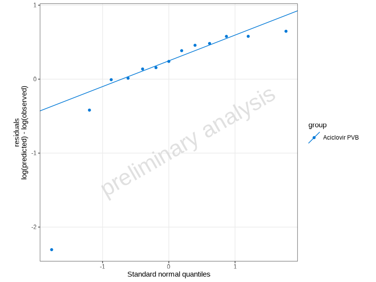

Points falling along the diagonal line indicate that the residuals
follow a normal distribution. Deviations suggest non-normality.

``` r
# Use linear residuals
plotQuantileQuantilePlot(myDataCombined, residualScale = "linear")
```

## Automatic Unit Conversion

A key feature of these plotting functions is automatic unit conversion.
For manual unit conversion of `DataCombined` objects outside of
plotting, you can use the
[`convertUnits()`](https://www.open-systems-pharmacology.org/OSPSuite-R/reference/convertUnits.md)
function. When using a `DataCombined` object with mixed units in
plotting functions:

- The target unit is automatically determined by the most frequently
  occurring unit in the observed data
- If no observed data exists, the most common unit in simulated data is
  used
- Concentration dimensions (`Concentration (mass)` and
  `Concentration (molar)`) are treated as compatible
- Conversion between mass and molar concentrations is possible if
  molecular weight is available

This ensures that all data is displayed in consistent units without
manual conversion.

### Specifying Units Directly

All plotting functions in this family accept `xUnit` and `yUnit`
arguments. Here, `xUnit` and `yUnit` refer to the unit field names in
the underlying `DataCombined` data frame (`xUnit` for the x-values
column, `yUnit` for the y-values column), which do not necessarily
correspond to the physical x- or y-axis of the resulting plot. For
example, in
[`plotPredictedVsObserved()`](https://www.open-systems-pharmacology.org/OSPSuite-R/reference/plotPredictedVsObserved.md),
`yUnit` controls the unit for both axes since both predicted and
observed are taken from the y-values of the data.

[`plotTimeProfile()`](https://www.open-systems-pharmacology.org/OSPSuite-R/reference/plotTimeProfile.md)
additionally accepts `y2Unit` for controlling the secondary y-axis unit
when data contains two distinct y-dimensions (i.e., when a secondary
y-axis is used for a different measurement type such as `Fraction`
alongside `Concentration`). The function
[`plotResidualsVsCovariate()`](https://www.open-systems-pharmacology.org/OSPSuite-R/reference/plotResidualsVsCovariate.md)
supports `xUnit` and `yUnit`, all other functions
([`plotPredictedVsObserved()`](https://www.open-systems-pharmacology.org/OSPSuite-R/reference/plotPredictedVsObserved.md),
[`plotResidualsAsHistogram()`](https://www.open-systems-pharmacology.org/OSPSuite-R/reference/plotResidualsAsHistogram.md),
[`plotQuantileQuantilePlot()`](https://www.open-systems-pharmacology.org/OSPSuite-R/reference/plotQuantileQuantilePlot.md))
support `yUnit` only.

``` r
# Default: auto-detected units (e.g. µmol/l and h from the data)
plotTimeProfile(myDataCombined)
```


``` r
# Override x-axis unit: display time in minutes instead of hours
plotTimeProfile(myDataCombined, xUnit = "min", yUnit = "mg/l")
```


Passing units directly is equivalent to pre-converting the data with
[`convertUnits()`](https://www.open-systems-pharmacology.org/OSPSuite-R/reference/convertUnits.md):

``` r
plotTimeProfile(convertUnits(myDataCombined, xUnit = "min", yUnit = "mg/l"))
```

## Handling Mixed Error Types

These functions automatically handle datasets with different error type
specifications:

- If all data uses the same error type (`ArithmeticStdDev` or
  `GeometricStdDev`), it is used directly
- If data contains **mixed error types**, they are automatically
  converted to `yMin`/`yMax` bounds:
  - `ArithmeticStdDev`: `yMin = yValues - yErrorValues`,
    `yMax = yValues + yErrorValues`
  - `GeometricStdDev`: `yMin = yValues / yErrorValues`,
    `yMax = yValues * yErrorValues`

## Using data.table Instead of DataCombined

While these functions are designed to work with `DataCombined` objects,
you can also provide a `data.table` directly. Use `toDataFrame()` to
convert a `DataCombined` object to a data frame if needed. The table
must include the following columns:

- `xValues`: Numeric time points or x-axis values
- `yValues`: Observed or simulated values (numeric)
- `group`: Grouping variable (factor or character)
- `name`: Name for the dataset (factor or character)
- `xUnit`: Unit of the x-axis values (character)
- `yUnit`: Unit of the y-axis values (character)
- `dataType`: Specifies data type—either `"observed"` or `"simulated"`

Optional columns: - `yErrorType`: Type of y error (see
[`ospsuite::DataErrorType`](https://www.open-systems-pharmacology.org/OSPSuite-R/reference/DataErrorType.md)) -
`yErrorValues`: Numeric error values - `yMin`, `yMax`: Custom ranges for
y-axis - `IndividualId`: Used for aggregation of simulated population
data - `predicted`: Predicted values (required for residual plots)

## Further Customization

All plotting functions accept additional arguments that are passed to
the underlying `ospsuite.plots` functions. This allows for extensive
customization. Refer to the
[ospsuite.plots](https://www.open-systems-pharmacology.org/OSPSuite.Plots/)
package documentation for details.

Additionally, since all functions return `ggplot2` objects, you can
further modify them using standard `ggplot2` functions:

``` r
library(ggplot2)

# Create a plot and customize it
p <- plotTimeProfile(myDataCombined)

# Add customizations
p <- p +
  theme_minimal() +
  labs(title = "My Custom Title") +
  theme(legend.position = "bottom")

print(p)
```

## Saving Plots

Since all functions return `ggplot2` objects, you can save them using
[`ospsuite.plots::exportPlot()`](https://www.open-systems-pharmacology.org/OSPSuite.Plots/reference/exportPlot.html):

``` r
# Create a plot
myPlot <- plotTimeProfile(myDataCombined)

# Save to file using ospsuite.plots::exportPlot
ospsuite.plots::exportPlot(
  plotObject = myPlot,
  filePath = "timeprofile.png",
  width = 8,
  height = NULL,
  dpi = 300
)
```

This function is a wrapper around
[`ggsave()`](https://ggplot2.tidyverse.org/reference/ggsave.html) that
automatically adjusts the plot height based on content when
`height = NULL`.

Alternatively, you can use directly the standard
[`ggsave()`](https://ggplot2.tidyverse.org/reference/ggsave.html)
function from `ggplot2`:

``` r
# Save using ggsave
ggsave("timeprofile.png", myPlot, width = 8, height = 6, dpi = 300)
```
