# Visualizations with \`DataCombined\`

## Introduction

You have already seen how the `DataCombined` class can be utilized to
store observed and/or simulated data (if not, read [Working with
`DataCombined`
class](https://www.open-systems-pharmacology.org/OSPSuite-R/dev/articles/data-combined.md)).

Let’s first create a `DataCombined` object, which we will use to
demonstrate different visualizations available.

``` r

library(ospsuite)

# simulated data
simFilePath <- system.file("extdata", "Aciclovir.pkml", package = "ospsuite")
sim <- loadSimulation(simFilePath)
simResults <- runSimulations(sim)[[1]]
outputPath <- "Organism|PeripheralVenousBlood|Aciclovir|Plasma (Peripheral Venous Blood)"

# observed data
obsData <- lapply(
  c("ObsDataAciclovir_1.pkml", "ObsDataAciclovir_2.pkml", "ObsDataAciclovir_3.pkml"),
  function(x) loadDataSetFromPKML(system.file("extdata", x, package = "ospsuite"))
)
names(obsData) <- lapply(obsData, function(x) x$name)

myDataCombined <- DataCombined$new()

myDataCombined$addSimulationResults(
  simulationResults = simResults,
  quantitiesOrPaths = outputPath,
  groups = "Aciclovir PVB"
)

myDataCombined$addDataSets(
  obsData$`Vergin 1995.Iv`,
  groups = "Aciclovir PVB"
)
```

## Time profile plots

Time profile plots visualize measured or simulated values against time
and help assess if the observed data (represented by symbols and error
bars) match the simulated data (represented by lines).

``` r

plotTimeProfile(myDataCombined)
```

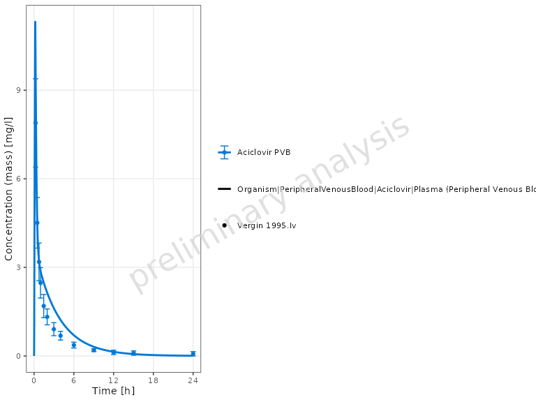

## Predicted versus observed scatter plot

Predicted versus observed plots allow to assess how far simulated
results are from observed values.

``` r

plotPredictedVsObserved(myDataCombined)
```

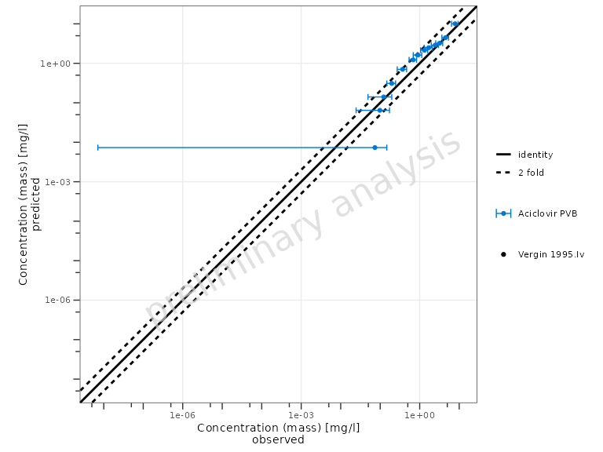

The identity line represents perfect correspondence of simulated values
with the observed ones. By default, a “two-fold” range is marked by the
dashed lines. The “x-fold” range is defined as values that are `x`-fold
higher and `1/x`-fold lower than the observed ones. The user can specify
multiple ranges by the `comparisonLineVector` argument.

``` r

plotPredictedVsObserved(
  myDataCombined,
  comparisonLineVector = ospsuite.plots::getFoldDistanceList(folds = c(1.3, 2))
)
```

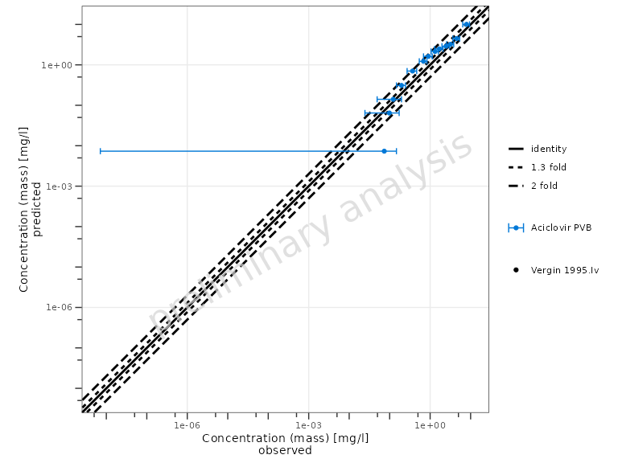

## Residuals versus covariate scatter plots

Residual plots show if there is a systematic bias in simulated values
either in high-concentration or low-concentration regions, or,
alternatively, in early or late time periods.

``` r

plotResidualsVsCovariate(myDataCombined, xAxis = "predicted")
```

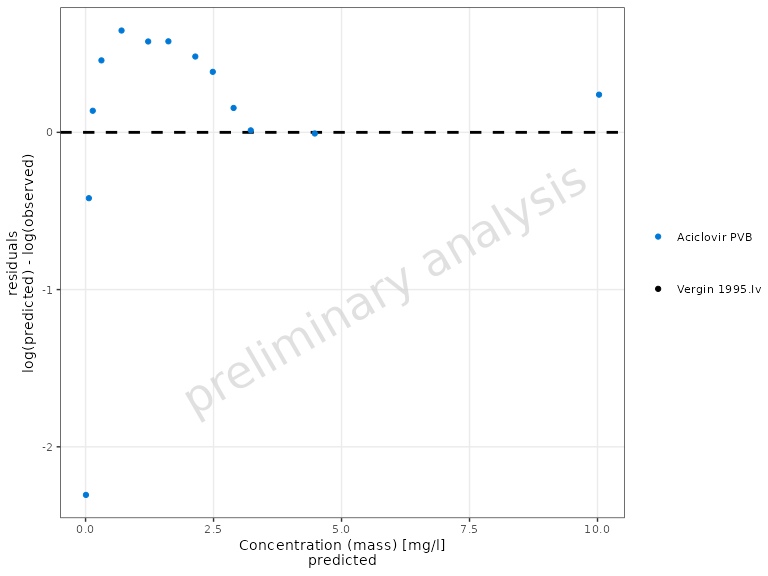

``` r

plotResidualsVsCovariate(myDataCombined, xAxis = "time")
```

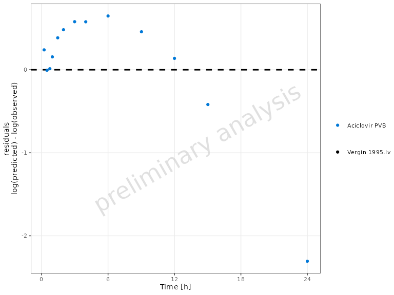

Residuals of log values can be visualized with the `residualScale`
argument (`"log"` by default, or `"linear"` / `"ratio"`).

``` r

plotResidualsVsCovariate(
  myDataCombined, 
  xAxis = "time", 
  residualScale = "linear"
  )
```

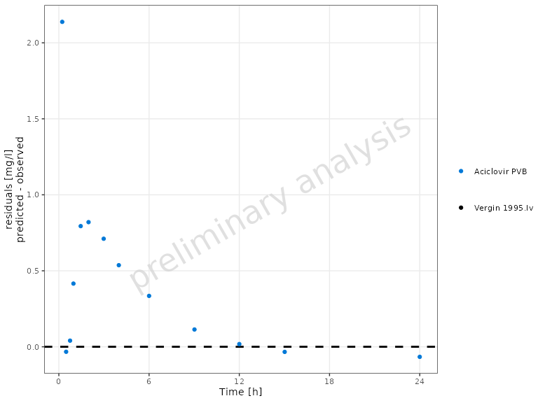

## Customizing plots

All functions return `ggplot2` objects, so any standard `ggplot2` layer
can be added directly.

### Units and axis scaling

Pass `xUnit` / `yUnit` to set the display units, and `yScale` to change
the axis scale:

``` r

plotTimeProfile(
  myDataCombined,
  xUnit = ospUnits$Time$s,
  yUnit = ospUnits$`Concentration [mass]`$`µg/l`,
  yScale = "log"
)
```

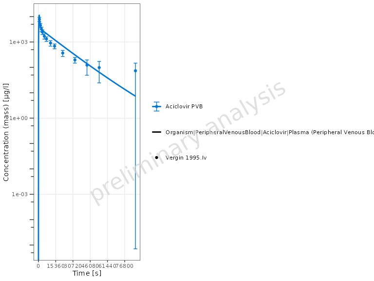

### Title, subtitle, and caption

``` r

plotTimeProfile(myDataCombined) +
  ggplot2::labs(
    title = "Aciclovir — Individual Time Profile",
    subtitle = "Simulated vs. Observed (Vergin 1995)",
    caption = "Source: Aciclovir data set"
  )
```

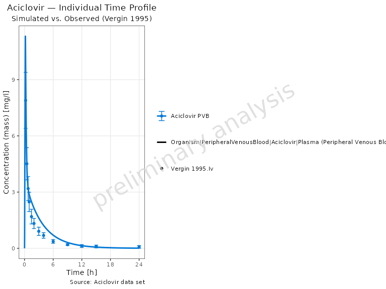

### Legend position

``` r

plotPredictedVsObserved(myDataCombined) +
  ggplot2::theme(legend.position = "bottom")
```

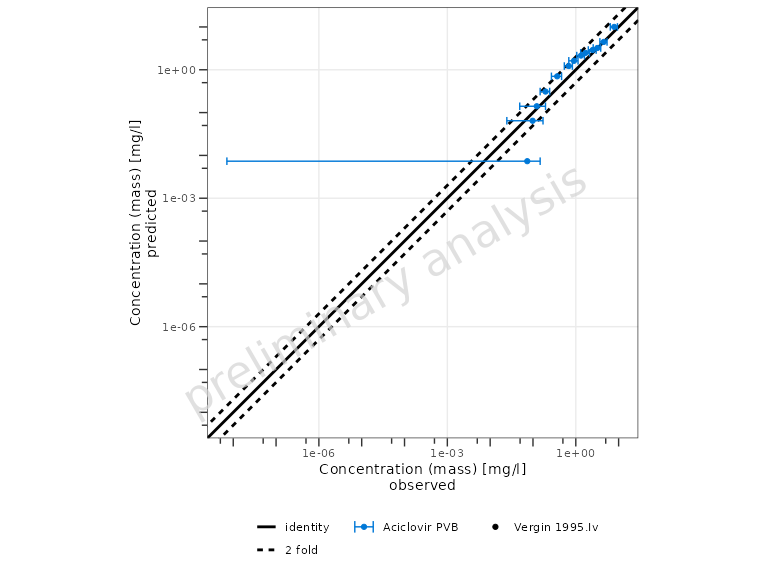

### Further theming

Any
[`ggplot2::theme()`](https://ggplot2.tidyverse.org/reference/theme.html)
element can be overridden:

``` r

plotTimeProfile(myDataCombined) +
  ggplot2::theme(
    axis.title = ggplot2::element_text(size = 13, face = "bold"),
    axis.text  = ggplot2::element_text(size = 11)
  )
```

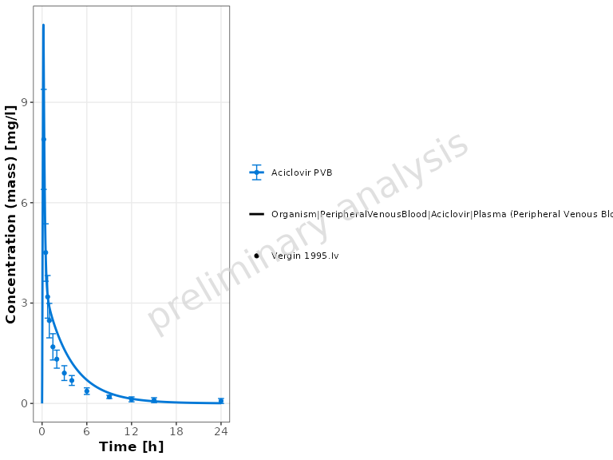

## Creating multi-panel figures

Because each function returns a `ggplot2` object, panels can be
assembled with the `patchwork` package:

``` r

library(patchwork)

p1 <- plotTimeProfile(myDataCombined) +
  ggplot2::labs(tag = "a")
p2 <- plotPredictedVsObserved(myDataCombined) +
  ggplot2::labs(tag = "b")
p3 <- plotResidualsVsCovariate(myDataCombined, xAxis = "predicted") +
  ggplot2::labs(tag = "c")
p4 <- plotResidualsVsCovariate(myDataCombined, xAxis = "time") +
  ggplot2::labs(tag = "d")

(p1 | p2) / (p3 | p4)
```

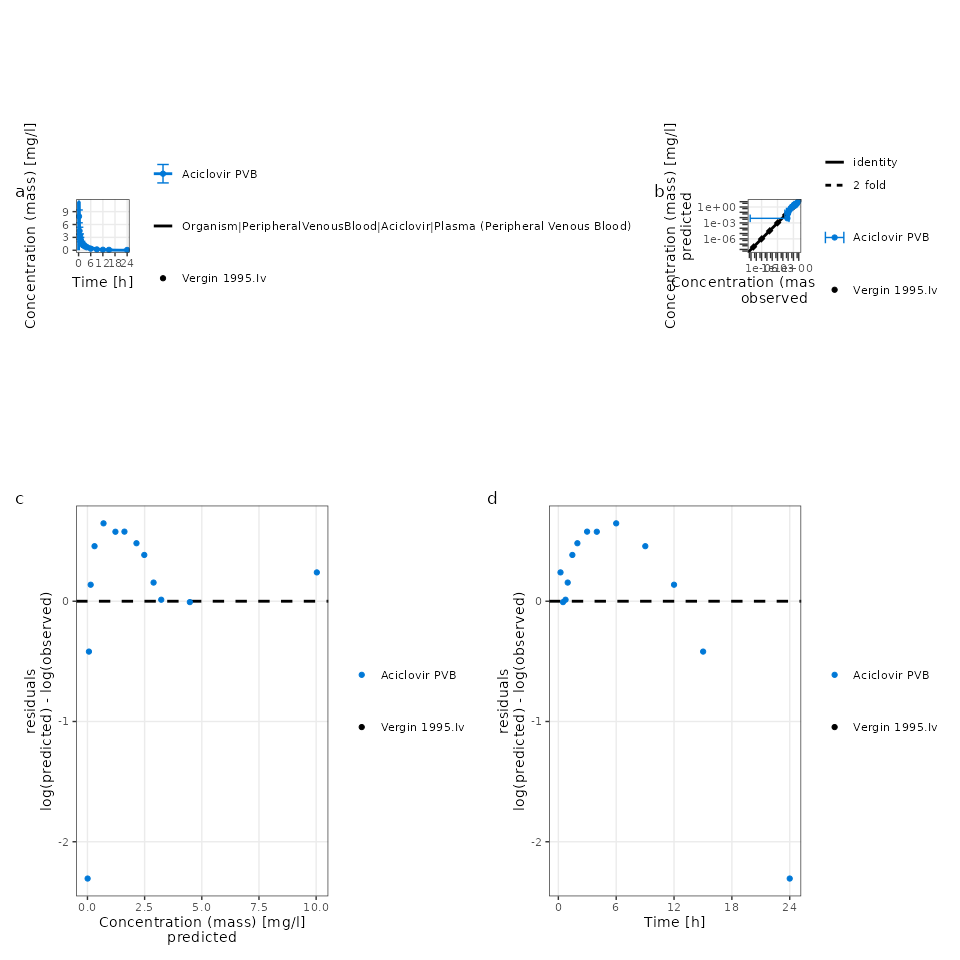

Control the layout with
[`patchwork::plot_layout()`](https://patchwork.data-imaginist.com/reference/plot_layout.html):

``` r

p1 / p2 / p3 / p4
```

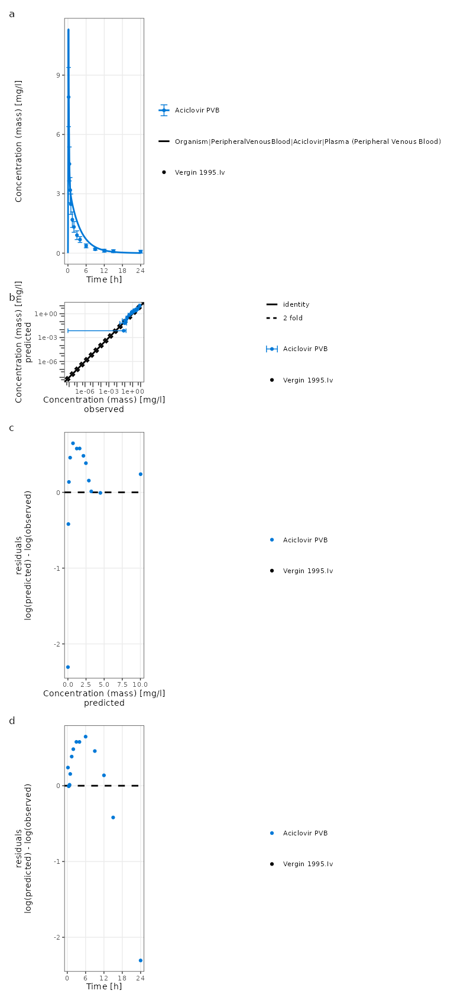

## Saving plots

Use
[`ospsuite.plots::exportPlot()`](https://www.open-systems-pharmacology.org/OSPSuite.Plots/reference/exportPlot.html)
to save a plot to disk:

``` r

plotObject <- plotTimeProfile(myDataCombined)

ospsuite.plots::exportPlot(
  plotObject = plotObject,
  filepath   = "timeprofile.png",
  width      = 8,
  height     = NULL, # auto-computed from content
  dpi        = 300
)
```

Or use
[`ggplot2::ggsave()`](https://ggplot2.tidyverse.org/reference/ggsave.html)
directly:

``` r

plotObject <- plotTimeProfile(myDataCombined)

ggplot2::ggsave(
  filename = "timeprofile.png", 
  plot = plotObject, 
  width = 8, 
  height = 6, 
  dpi = 300
  )
```

## Implementation details

All plotting functions in
[ospsuite](https://github.com/open-systems-pharmacology/ospsuite-r) make
use of the
[ospsuite.plots](https://www.open-systems-pharmacology.org/OSPSuite.Plots/)
package to prepare visualizations. To know more about this library, see
its
[website](https://www.open-systems-pharmacology.org/OSPSuite.Plots/).
