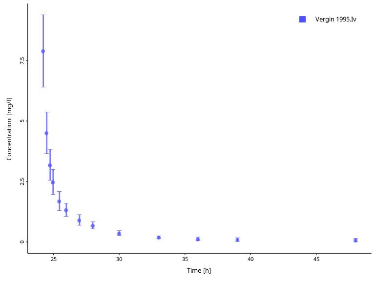

# Working with \`DataCombined\` class

## Introduction

In Modeling and Simulation (M&S) workflows, we often need to work with
multiple observed and/or simulated datasets. Some of these datasets can
be linked together in a group (e.g., the simulated and the corresponding
observed data) for analysis and visualization.

The `DataCombined` class in
[ospsuite](https://github.com/open-systems-pharmacology/ospsuite-r)
provides a container to store data, to group them, and to transform them
(e.g. scale or offset). The class accepts data coming from
`SimulationResults` or as a `DataSet` object (see [Observed
data](https://www.open-systems-pharmacology.org/OSPSuite-R/dev/articles/observed-data.md)).

Let’s first generate some simulation results and load observed data.

``` r
library(ospsuite)

# Simulation results
simFilePath <- system.file("extdata", "Aciclovir.pkml", package = "ospsuite")
sim <- loadSimulation(simFilePath)
simResults <- runSimulations(sim)[[1]]
outputPath <- "Organism|PeripheralVenousBlood|Aciclovir|Plasma (Peripheral Venous Blood)"

# observed data
obsData <- lapply(
  c("ObsDataAciclovir_1.pkml", "ObsDataAciclovir_2.pkml", "ObsDataAciclovir_3.pkml"),
  function(x) loadDataSetFromPKML(system.file("extdata", x, package = "ospsuite"))
)
# Name the elements of the list according to the names of the loaded `DataSet`.
names(obsData) <- lapply(obsData, function(x) x$name)
```

Typically, `DataCombined` is used to create figures using the
`plotXXX()` functions. The different plot types are described in
[Visualizations with
`DataCombined`](https://www.open-systems-pharmacology.org/OSPSuite-R/dev/articles/data-combined-plotting.md).
To visualize the different functionalities of `DataCombined` in this
document, we will use the
[`plotIndividualTimeProfile()`](https://www.open-systems-pharmacology.org/OSPSuite-R/dev/reference/plotIndividualTimeProfile.md)
function.

## Creating `DataCombined` object

First, we create a new instance of `DataCombined` class.

``` r
myDataCombined <- DataCombined$new()
```

Then we add simulated results to this object using
`$addSimulationResults()`:

``` r
myDataCombined$addSimulationResults(
  simulationResults = simResults,
  quantitiesOrPaths = outputPath,
  names = "Aciclovir Plasma",
  groups = "Aciclovir PVB"
)
```

Next we add observed data to this object using `$addDataSets()`:

``` r
myDataCombined$addDataSets(
  obsData$`Vergin 1995.Iv`,
  groups = "Aciclovir PVB"
)
```

Every data, be it simulated results or from `DataSet`, must have a
unique name within `DataCombined`. If not specified by user, the path of
simulated results or the `$name` property of the `DataSet` are used as
the name. Alternatively, we can define the name when adding the data, as
in the above example adding simulated results.

There are a few things to keep in mind here:

- It doesn’t matter in which order observed or simulated datasets are
  added.
- You can add multiple `DataSet` objects in `$addDataSets()` method
  call.
- You can add only a single instance of `SimulationResults` in
  `$addSimulationResults()` method call.
- If you add a dataset with the same name as existing (e.g., adding
  simulation results from multiple simulations and not specifying the
  name, so the path of the results is used as the name), the new data
  will replace the existing.

## Grouping

Since the `DataCombined` object can store many datasets, some of them
may naturally form a grouping and you would wish to track this in the
object. Both `$addDataSets()` and `$addSimulationResults()` allow group
specification via `groups` argument.

When being plotted, data sets without a grouping will appear with
distinct color, line style (for simulated results), or symbol style (for
observed data) with a separate entry in the legend, with the name of the
data set being the legend entry.

Though it is possible to group data with different dimensions, it makes
sense to only group data sets that have the same dimension (or
dimensions that can be transformed into each other, like `Amount` and
`Mass`) in order to be able to compare the data. Grouping data sets with
different dimensions most likely will result in an error when trying to
create plots or calculating residuals with such a `DataCombined`.

Let’s create a `DataCombined` and add simulation results and observed
data *without* specifying their grouping and create a time profile:

``` r
myDataCombined <- DataCombined$new()

myDataCombined$addSimulationResults(
  simulationResults = simResults,
  quantitiesOrPaths = outputPath,
  names = "Aciclovir Plasma"
)

myDataCombined$addDataSets(
  obsData$`Vergin 1995.Iv`
)

plotIndividualTimeProfile(dataCombined = myDataCombined)
```


If you do not specify `groups` when you add datasets, and wish to update
groupings later, you can use the `$setGroups()` method. All data within
one group will get one entry in the legend with the name of the group,
and will be plotted with the same color.

``` r
myDataCombined$setGroups(
  names = c("Aciclovir Plasma", obsData$`Vergin 1995.Iv`$name),
  groups = c("Aciclovir PVB", "Aciclovir PVB")
)

plotIndividualTimeProfile(dataCombined = myDataCombined)
```


At any point, you can check the current names and groupings with the
following active field:

``` r
myDataCombined$groupMap
#> # A tibble: 2 × 3
#>   name             group         dataType 
#>   <chr>            <chr>         <chr>    
#> 1 Aciclovir Plasma Aciclovir PVB simulated
#> 2 Vergin 1995.Iv   Aciclovir PVB observed
```

## Transformations

Sometimes the raw data included in `DataCombined` needs to be
transformed using specified offset and scale factor values.

This is supported via `$setDataTransformations()` method, where you can
specify the names of datasets, and offsets and scale factors. If these
arguments are scalar (i.e., of length 1), then the same value will be
applied to all specified names. Scale factors are unitless values by
which raw data values will be multiplied, offsets are added to the raw
values without any conversion and must therefore be in the same units as
the raw data.

The internal data frame in `DataCombined` will be transformed with the
specified parameters, with the new columns computed as:

- For x values: `newXValue = (rawXValue + xOffset) * xScaleFactor`
- For y values: `newYValue = (rawYValue + yOffset) * yScaleFactor`
- For arithmetic error:
  `newErrorValue = rawErrorValue * abs(yScaleFactor)`
- For geometric error: no transformation.

At any point, you can check the applied offsets and scale factors with
the following active field:

``` r
myDataCombined$dataTransformations
#> # A tibble: 2 × 5
#>   name             xOffsets yOffsets xScaleFactors yScaleFactors
#>   <chr>               <dbl>    <dbl>         <dbl>         <dbl>
#> 1 Aciclovir Plasma        0        0             1             1
#> 2 Vergin 1995.Iv          0        0             1             1
```

Now lets take a closer look on possible situations where you would apply
any transformations. Consider the observed data from the examples above.
It reports concentrations of aciclovir after single intravenous
administration.

``` r
myDataCombinedTranformations <- DataCombined$new()

myDataCombinedTranformations$addDataSets(
  obsData$`Vergin 1995.Iv`
)

plotIndividualTimeProfile(dataCombined = myDataCombinedTranformations)
```


However, we might want to use this data set with a simulation where
aciclovir is administered 24 hours after simulation begin. To be able to
compare simulation results with the data set, we can *offset* the
observed data time by 24 hours. Keep in mind that the offset must be
given in the same unit as the data set values are.

``` r
# Check the units of the observed time values
obsData$`Vergin 1995.Iv`$xUnit
#> [1] "h"

myDataCombinedTranformations$setDataTransformations(
  forNames = obsData$`Vergin 1995.Iv`$name,
  xOffsets = 24
)

plotIndividualTimeProfile(dataCombined = myDataCombinedTranformations)
```



In the next step, we want to *normalize* observed concentrations to a
dose. We can easily achieve this with the scale factor. In the next
example, we normalize observed values to 250 mg dose by setting the
`yScaleFactor` to 1/250:

``` r
myDataCombinedTranformations$setDataTransformations(
  forNames = obsData$`Vergin 1995.Iv`$name,
  yScaleFactors = 1 / 250
)

plotIndividualTimeProfile(dataCombined = myDataCombinedTranformations)
```

 Finally,
offsetting the observation values might be useful when working with
measurements of endogenous substrates, such as the hormone glucagon, and
want to correct for the individual specific baseline levels of the
hormone.

## Extracting a combined data frame

The data frame (also sometimes called as a table) data structure is
central to R-based workflows, and, thus, we may wish to extract a data
frame for datasets present in the object.

Internally, `DataCombined` extracts data frames for observed and
simulated datasets and combines them.

``` r
myDataCombined$toDataFrame()
#> # A tibble: 504 × 27
#>    IndividualId xValues name           yValues xDimension xUnit yDimension yUnit
#>           <int>   <dbl> <chr>            <dbl> <chr>      <chr> <chr>      <chr>
#>  1            0       0 Aciclovir Pla…    0    Time       min   Concentra… µmol…
#>  2            0       1 Aciclovir Pla…    3.25 Time       min   Concentra… µmol…
#>  3            0       2 Aciclovir Pla…    9.10 Time       min   Concentra… µmol…
#>  4            0       3 Aciclovir Pla…   15.0  Time       min   Concentra… µmol…
#>  5            0       4 Aciclovir Pla…   20.7  Time       min   Concentra… µmol…
#>  6            0       5 Aciclovir Pla…   26.2  Time       min   Concentra… µmol…
#>  7            0       6 Aciclovir Pla…   31.4  Time       min   Concentra… µmol…
#>  8            0       7 Aciclovir Pla…   36.4  Time       min   Concentra… µmol…
#>  9            0       8 Aciclovir Pla…   41.1  Time       min   Concentra… µmol…
#> 10            0       9 Aciclovir Pla…   45.5  Time       min   Concentra… µmol…
#> # ℹ 494 more rows
#> # ℹ 19 more variables: molWeight <dbl>, dataType <chr>, yErrorValues <dbl>,
#> #   yErrorType <chr>, yErrorUnit <chr>, lloq <dbl>, Source <chr>, File <chr>,
#> #   Sheet <chr>, Molecule <chr>, Species <chr>, Organ <chr>, Compartment <chr>,
#> #   `Study Id` <chr>, Gender <chr>, Dose <chr>, Route <chr>,
#> #   `Patient Id` <chr>, group <chr>
```

This function returns a [tibble data
frame](https://r4ds.had.co.nz/tibbles.html#tibbles-vs.-data.frame). If
you wish to modify how it is printed, you can have a look at the
available options
[here](https://pillar.r-lib.org/reference/pillar_options.html). In fact,
let’s change a few options and print the data frame again.

``` r
options(
  pillar.width = Inf, # show all columns
  pillar.min_chars = Inf # to turn off truncation of column titles
)

myDataCombined$toDataFrame()
```

    #> # A tibble: 504 × 27
    #>    IndividualId xValues name             yValues xDimension xUnit
    #>           <int>   <dbl> <chr>              <dbl> <chr>      <chr>
    #>  1            0       0 Aciclovir Plasma    0    Time       min  
    #>  2            0       1 Aciclovir Plasma    3.25 Time       min  
    #>  3            0       2 Aciclovir Plasma    9.10 Time       min  
    #>  4            0       3 Aciclovir Plasma   15.0  Time       min  
    #>  5            0       4 Aciclovir Plasma   20.7  Time       min  
    #>  6            0       5 Aciclovir Plasma   26.2  Time       min  
    #>  7            0       6 Aciclovir Plasma   31.4  Time       min  
    #>  8            0       7 Aciclovir Plasma   36.4  Time       min  
    #>  9            0       8 Aciclovir Plasma   41.1  Time       min  
    #> 10            0       9 Aciclovir Plasma   45.5  Time       min  
    #>    yDimension            yUnit  molWeight dataType  yErrorValues yErrorType
    #>    <chr>                 <chr>      <dbl> <chr>            <dbl> <chr>     
    #>  1 Concentration (molar) µmol/l      225. simulated           NA NA        
    #>  2 Concentration (molar) µmol/l      225. simulated           NA NA        
    #>  3 Concentration (molar) µmol/l      225. simulated           NA NA        
    #>  4 Concentration (molar) µmol/l      225. simulated           NA NA        
    #>  5 Concentration (molar) µmol/l      225. simulated           NA NA        
    #>  6 Concentration (molar) µmol/l      225. simulated           NA NA        
    #>  7 Concentration (molar) µmol/l      225. simulated           NA NA        
    #>  8 Concentration (molar) µmol/l      225. simulated           NA NA        
    #>  9 Concentration (molar) µmol/l      225. simulated           NA NA        
    #> 10 Concentration (molar) µmol/l      225. simulated           NA NA        
    #>    yErrorUnit  lloq Source File  Sheet Molecule Species Organ Compartment
    #>    <chr>      <dbl> <chr>  <chr> <chr> <chr>    <chr>   <chr> <chr>      
    #>  1 NA            NA NA     NA    NA    NA       NA      NA    NA         
    #>  2 NA            NA NA     NA    NA    NA       NA      NA    NA         
    #>  3 NA            NA NA     NA    NA    NA       NA      NA    NA         
    #>  4 NA            NA NA     NA    NA    NA       NA      NA    NA         
    #>  5 NA            NA NA     NA    NA    NA       NA      NA    NA         
    #>  6 NA            NA NA     NA    NA    NA       NA      NA    NA         
    #>  7 NA            NA NA     NA    NA    NA       NA      NA    NA         
    #>  8 NA            NA NA     NA    NA    NA       NA      NA    NA         
    #>  9 NA            NA NA     NA    NA    NA       NA      NA    NA         
    #> 10 NA            NA NA     NA    NA    NA       NA      NA    NA         
    #>    `Study Id` Gender Dose  Route `Patient Id` group        
    #>    <chr>      <chr>  <chr> <chr> <chr>        <chr>        
    #>  1 NA         NA     NA    NA    NA           Aciclovir PVB
    #>  2 NA         NA     NA    NA    NA           Aciclovir PVB
    #>  3 NA         NA     NA    NA    NA           Aciclovir PVB
    #>  4 NA         NA     NA    NA    NA           Aciclovir PVB
    #>  5 NA         NA     NA    NA    NA           Aciclovir PVB
    #>  6 NA         NA     NA    NA    NA           Aciclovir PVB
    #>  7 NA         NA     NA    NA    NA           Aciclovir PVB
    #>  8 NA         NA     NA    NA    NA           Aciclovir PVB
    #>  9 NA         NA     NA    NA    NA           Aciclovir PVB
    #> 10 NA         NA     NA    NA    NA           Aciclovir PVB
    #> # ℹ 494 more rows

[ospsuite](https://github.com/open-systems-pharmacology/ospsuite-r) also
provides a few helper functions to modify the data frame further.

When multiple (observed and/or simulated) datasets are present in a data
frame, they are likely to have different units.
[`convertUnits()`](https://www.open-systems-pharmacology.org/OSPSuite-R/dev/reference/convertUnits.md)
function helps to convert them to a common unit. The function will not
modify the `DataCombined` object but return a new data frame with
unified units.[¹](#fn1).

``` r
convertUnits(
  myDataCombined,
  xUnit = ospUnits$Time$s,
  yUnit = ospUnits$`Concentration [mass]`$`µg/l`
)
#> # A tibble: 504 × 27
#>    IndividualId xValues name           yValues xDimension xUnit yDimension yUnit
#>           <int>   <dbl> <chr>            <dbl> <chr>      <chr> <chr>      <chr>
#>  1            0       0 Aciclovir Pla…      0  Time       s     Concentra… µg/l 
#>  2            0      60 Aciclovir Pla…    733. Time       s     Concentra… µg/l 
#>  3            0     120 Aciclovir Pla…   2050. Time       s     Concentra… µg/l 
#>  4            0     180 Aciclovir Pla…   3382. Time       s     Concentra… µg/l 
#>  5            0     240 Aciclovir Pla…   4668. Time       s     Concentra… µg/l 
#>  6            0     300 Aciclovir Pla…   5901. Time       s     Concentra… µg/l 
#>  7            0     360 Aciclovir Pla…   7077. Time       s     Concentra… µg/l 
#>  8            0     420 Aciclovir Pla…   8194. Time       s     Concentra… µg/l 
#>  9            0     480 Aciclovir Pla…   9249. Time       s     Concentra… µg/l 
#> 10            0     540 Aciclovir Pla…  10242. Time       s     Concentra… µg/l 
#> # ℹ 494 more rows
#> # ℹ 19 more variables: molWeight <dbl>, dataType <chr>, yErrorValues <dbl>,
#> #   yErrorType <chr>, yErrorUnit <chr>, lloq <dbl>, Source <chr>, File <chr>,
#> #   Sheet <chr>, Molecule <chr>, Species <chr>, Organ <chr>, Compartment <chr>,
#> #   `Study Id` <chr>, Gender <chr>, Dose <chr>, Route <chr>,
#> #   `Patient Id` <chr>, group <chr>
```

## Further functionalities

Grouping of simulated results with observed data inside `DataCombined`
also allows to calculate the error between simulated results and
observations using the
[`calculateResiduals()`](https://www.open-systems-pharmacology.org/OSPSuite-R/dev/reference/calculateResiduals.md)
function. The function calculates the distance between each observed
data point within the group and the simulated results. Simulation
results interpolated if no simulated value is available for a certain
observed time point. Observed data beyond simulated time is ignored,
i.e., no *extrapolation* is performed.

There are two ways to calculate the distance (residuals) - linear and
logarithmic - specified by the `scaling` argument. For linear scaling
(`scaling = tlf::Scaling$lin`):

> Residuals are calculated as: Simulation value - Observed value. This
> means that the residuals are defined by absolute differences.

For logarithmic scaling (`scaling = tlf::Scaling$log`):

> Residuals are calculated as: log(Simulation value) - log(Observed
> value) = log (Simulation Value / Observed Value). This means that the
> ratio of values is considered which is independent of the magnitude of
> the value. But for very small observed values, in particular close to
> 0 values, this can lead to problems, because log(10E-N) = -N can
> becomes large.

``` r
# Linear residuals
calculateResiduals(myDataCombined, scaling = tlf::Scaling$lin)$residualValues
#>  [1]  9.49304275 -0.14538952  0.17965548  1.84599976  3.52552442  3.64160094
#>  [7]  3.15654735  2.38392729  1.48703530  0.50532597  0.08009793 -0.14892803
#> [13] -0.29395086

# Logarithmic residuals
calculateResiduals(myDataCombined, scaling = tlf::Scaling$log)$residualValues
#>  [1]  0.239719620 -0.007286928  0.012618336  0.155242835  0.384912455
#>  [6]  0.482210178  0.578799737  0.577914238  0.647582143  0.457679775
#> [11]  0.137321647 -0.418715711 -2.305882655
```

To quickly calculate the total error of the `DataCombined`, one can sum
up the absolute values of the residuals:

``` r
# Linear residuals
totalError <- sum(abs(calculateResiduals(myDataCombined, scaling = tlf::Scaling$lin)$residualValues))

print(totalError)
#> [1] 26.88703
```

## Visualizations with `DataCombined`

See [Visualizations with
`DataCombined`](https://www.open-systems-pharmacology.org/OSPSuite-R/dev/articles/data-combined-plotting.md)
describing functions that can visualize data stored in `DataCombined`
object.

------------------------------------------------------------------------

1.  Note that if you are using `DataCombined` object for plotting
    functions, you don’t need to this conversion; the plotting functions
    will take care of this internally.
