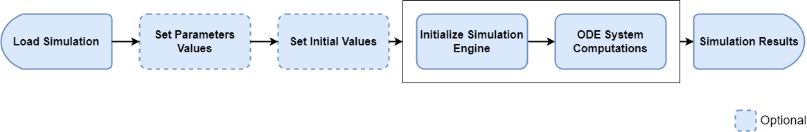
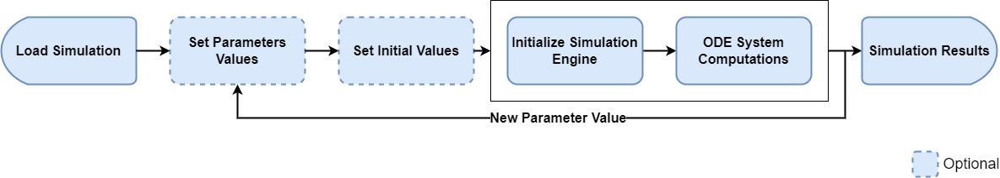
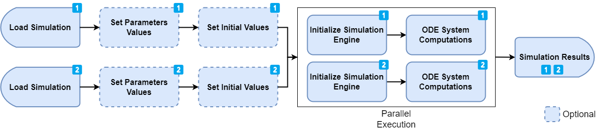
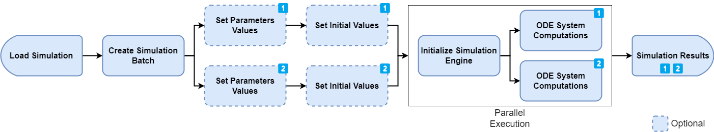

# Efficient calculation

There are a few ways to run simulations using this package. The easiest
way is, as expected, not necessarily the most efficient one. So
depending on the use case, a different approach than what is outlined in
[Run
Simulations](https://www.open-systems-pharmacology.org/OSPSuite-R/dev/articles/run-simulation.md)
might be more suited.

This vignette aims at describing some scenarios and the suggested
methods to efficiently run simulations.

## Life cycle of a simulation run

In general, a user loads a simulation, updates some parameter values,
calculates the simulation and retrieves the results. Here are some steps
inherent to each simulation:

1.  Loading a simulation
2.  Optional: Setting parameter values
3.  Optional: Setting initial values
4.  Initializing the simulation engine
5.  Solving the ODE System (calculating the outputs)

Depending on the simulation of interest, some steps might take much
longer than others. For example, a simulation with multiple
administrations simulated over many months will load and initialize
quickly (1 and 4) while calculating (5) will be the critical step. On
the other hand, a simulation with dozens of compounds will also take
time to load and initialize (1 and 4).

## Running a single simulation once

This is by far the easiest use cases. A simulation is loaded from a
.pkml file and the outputs are calculated. In this use case, step 4 and
5 are automatically lumped together in one single call (See [Run
Simulations](https://www.open-systems-pharmacology.org/OSPSuite-R/dev/articles/run-simulation.md)
for more details).



## Running a single simulation multiple times and varying some parameters/initial values between each run

This is already a use case where the optimal and most efficient way
depends drastically on the simulation at hand. Let’s assume that we want
to calculate the outputs of a simulation for different doses.

A simple implementation could follow the following idea, where a
simulation is loaded once, the dose value is updated and the simulation
is calculated for each dose of interest.



``` r
library(ospsuite)

# Load and run the simulation
simFilePath <- system.file("extdata", "Aciclovir.pkml", package = "ospsuite")
sim <- loadSimulation(simFilePath)
doseParameter <- getAllParametersMatching(toPathString("Applications", "**", "Dose"), sim)[[1]]

# run for dose 100mg
doseParameter$value <- toBaseUnit(doseParameter, 100, "mg")
result100 <- runSimulations(simulations = sim)

# run for dose 200mg
doseParameter$value <- toBaseUnit(doseParameter, 200, "mg")
result200 <- runSimulations(simulations = sim)

# ...

# run for dose 500mg
doseParameter$value <- toBaseUnit(doseParameter, 500, "mg")
result500 <- runSimulations(simulations = sim)
```

This implementation is fairly easy to understand, but has potentially
one big performance bottleneck. Each simulation run is performed
**sequentially** (i.e. one at a time). That means that there will not be
any performance boost from having multiple cores on the machine. If the
simulation only takes a few seconds to run, this solution is absolutely
acceptable. However, if we assume that a simulation takes 1h to run,
this code would take over 5h to complete, as each `runSimulations` call
would be executed sequentially.

When the simulation run time (5) is much greater than the loading (1)
and initialization time (4), a better approach is to load the simulation
multiple times and run the simulation concurrently (i.e. in parallel).



Consider the following implementation:

``` r
library(ospsuite)
# Load and run the simulation
simFilePath <- system.file("extdata", "Aciclovir.pkml", package = "ospsuite")

loadSimulationWithDose <- function(doseInMg) {
  sim <- loadSimulation(simFilePath, loadFromCache = FALSE)
  doseParameter <- getAllParametersMatching(toPathString("Applications", "**", "Dose"), sim)[[1]]
  doseParameter$value <- toBaseUnit(doseParameter, doseInMg, "mg")
  return(sim)
}

# Creates 5 instances of a simulation (This is very fast for typical simulations)
sim100 <- loadSimulationWithDose(doseInMg = 100)
sim200 <- loadSimulationWithDose(doseInMg = 200)
sim300 <- loadSimulationWithDose(doseInMg = 300)
sim400 <- loadSimulationWithDose(doseInMg = 400)
sim500 <- loadSimulationWithDose(doseInMg = 500)


# Runs the simulation in parallel
results <- runSimulations(simulations = list(sim100, sim200, sim300, sim400, sim500))

# Results in now a list of SimulationResults
```

This implementation is also fairly straight forward. We load the
simulation multiple times from the same file (note the usage of
`loadFromCache = FALSE` to ensure that we always get a new instance of a
simulation and not the same instance) and we set the dose. Then, we call
the `runSimulations` function with the list of simulations. The engine
will run these simulations in parallel, which means that the overall
execution time should be slightly more than 1h, as each run would be
executed **at the same time**.

## Optimized loading for running simulations with predefined set of variable parameters

This is a more advanced use case, typically when implementing some kind
of optimization or sensitivity algorithms. The
[ospsuite](https://github.com/open-systems-pharmacology/ospsuite-r)
package introduces the concept of a **simulation batch**. With a
simulation batch, the variable parameters (or initial values) of a
simulation to vary between each run are specified explicitly during the
creation of the simulation batch. This allows the simulation engine to
speed up the system significantly as some equations can be rewritten and
simplified. A simulation batch also keeps the simplified simulation in
memory. That means that running a simulation again with a new set of
values will be much faster, as the initialization phase (4) is only done
if required and not for every run.



Consider the following implementation. We first create two simulation
batches for the same model and define the parameter values that can be
changed between runs. Note that, as opposed to the `Simulation` object,
we do not have access to any parameter/species values nor can we change
the outputs or simulation time.

``` r
library(ospsuite)
simFilePath <- system.file("extdata", "Aciclovir.pkml", package = "ospsuite")

# We load the simulation for which the batches will be created
sim1 <- loadSimulation(simFilePath, loadFromCache = FALSE)

# define the list of parameter that will be varied between the runs.
# For the first batch, we will vary 2 parameters: Lipophilicity and Permeability
parameterPaths <- c("Aciclovir|Lipophilicity", "Aciclovir|Permeability")

# define a first simulation batch
simBatch1 <- createSimulationBatch(simulation = sim1, parametersOrPaths = parameterPaths)

# for the second batch, we will vary Molecular Weight
simBatch2 <- createSimulationBatch(
  simulation = sim1,
  parametersOrPaths = c("Aciclovir|Molecular weight")
)

simulationBatches <- list(simBatch1, simBatch2)
```

In the next step, we define multiple runs of the simulation batch by
adding different parameter (and/or species start) values set. Each set
of values correspond to one run. The benefit of this approach is that
the initialization steps (1 and 4) are only performed once. After that,
only the execution time (step 5) will have an impact on the total
performance.

``` r
# now setting some parameter run values (the size of the array should match
# the number of parameters to vary for each batch
simBatch1$addRunValues(parameterValues = c(1, 2))
#> [1] "fd3f4594-4342-49ca-864a-926e50d816d7"
simBatch1$addRunValues(parameterValues = c(3, 4))
#> [1] "c27b89a5-3ebd-4d11-bf2d-1b001bb6dcf7"
simBatch1$addRunValues(parameterValues = c(5, 6))
#> [1] "ab3b1733-f605-441c-942f-62366059295c"

# We only have one parameter to vary for simBatch2, therefore only one value to set
simBatch2$addRunValues(parameterValues = 150)
#> [1] "e65086f5-f2d5-4534-b772-c6519fd1a575"
simBatch2$addRunValues(parameterValues = 200)
#> [1] "d92f61a5-9a67-413d-826a-1b2a900adc3c"
simBatch2$addRunValues(parameterValues = 300)
#> [1] "d837e206-ce29-4011-b9e9-6fdb81e7f345"
simBatch2$addRunValues(parameterValues = 400)
#> [1] "3442af9d-0714-4ff1-8e9e-6b2e789d9d95"
```

So far, we created 2 simulation batches, one with 3 parameter sets and
the other one with 4. That means that 3 runs will be enqueued for
simBatch1 and 4 will be enqueued for simBatch2. Each run gets a unique
id that can later be used to correctly assign simulation results to the
simulated set of parameters.

``` r
# Now we run the simulation batches.
# By doing so, 7 runs (3 for simBatch1 and 4 for simBatch2) will be executed in parallel.
# Please see documentation of runSimulationBatches for more details.
# The resulting output is a named list, where the names are the ids of the enqueued runs.
results <- runSimulationBatches(simulationBatches)
print(names(unlist(results)))
#> [1] "3eee1afc-343b-41f2-adee-c39bc237412a.fd3f4594-4342-49ca-864a-926e50d816d7"
#> [2] "3eee1afc-343b-41f2-adee-c39bc237412a.c27b89a5-3ebd-4d11-bf2d-1b001bb6dcf7"
#> [3] "3eee1afc-343b-41f2-adee-c39bc237412a.ab3b1733-f605-441c-942f-62366059295c"
#> [4] "34776b62-9ad1-404f-9da9-1255308279f9.e65086f5-f2d5-4534-b772-c6519fd1a575"
#> [5] "34776b62-9ad1-404f-9da9-1255308279f9.d92f61a5-9a67-413d-826a-1b2a900adc3c"
#> [6] "34776b62-9ad1-404f-9da9-1255308279f9.d837e206-ce29-4011-b9e9-6fdb81e7f345"
#> [7] "34776b62-9ad1-404f-9da9-1255308279f9.3442af9d-0714-4ff1-8e9e-6b2e789d9d95"
```

The enqueued run values are cleared after calling
[`runSimulationBatches()`](https://www.open-systems-pharmacology.org/OSPSuite-R/dev/reference/runSimulationBatches.md),
so executing the run again would result in an empty results list. We can
now set more values to the batches and run them again. Notes: - We do
not have to always set the same number of values at the same time -
Previous `runValues` are automatically cleared when
[`runSimulationBatches()`](https://www.open-systems-pharmacology.org/OSPSuite-R/dev/reference/runSimulationBatches.md)
is called.

``` r
simBatch1$addRunValues(parameterValues = c(10, 20))
#> [1] "86da4453-4ac6-4caa-b868-9570bc283912"
simBatch1$addRunValues(parameterValues = c(30, 40))
#> [1] "c37829c5-1d8b-43dc-8944-37257281b37b"
simBatch2$addRunValues(parameterValues = 500)
#> [1] "23cc7731-bb64-43b1-b9b9-d5c0a5e8198f"
simBatch2$addRunValues(parameterValues = 200)
#> [1] "195de45b-c298-4e1c-accb-e60d53db8df8"

# this run will be much faster as the simulation won't be initialized again.
# Only the new value will be set as specified when adding new run values with addRunValues
results2 <- runSimulationBatches(simulationBatches)

# Once the simulation batches instances are not needed anymore, they can be removed
# from the environment and the allocated memory cleared.
# This will be done automatically when the R session is terminated.
rm(simBatch1)
rm(simBatch2)
```

Usage of `SimulationBatch` is recommended for advanced scenarios where
simulations expected to be run hundreds of times and where each second
that can be spared will impact the performance significantly.

### Varying state variable parameters with SimulationBatch

State variable parameters, i.e., those defined by a right hand side
(RHS), are treated as molecules internally. Trying to create and run a
simulation batch with a state variable parameter set as a variable
parameter will result in an error:

``` r
stateVariableParam <- getParameter(path = "Organism|Lumen|Stomach|Liquid", container = sim1)
print(stateVariableParam)
#> <Parameter>
#>   • Quantity Type: Parameter
#>   • Path: Organism|Lumen|Stomach|Liquid
#>   • Value: 0.05 [l]
#> 
#> ── Formula ──
#> 
#>   • isExplicit: TRUE
#>   • formula: V*SteadyStateFillLevel
#>   • Value overrides formula: FALSE
#> 
#> ── State variable ──
#> 
#>   • isStateVariable: TRUE
#> 
#> ── RHSFormula 
#>   • isExplicit: TRUE
#>   • formula: OralApplicationsEnabled ? -LT_sto + Inflow*FillLevelFlag : 0

# Create simulation batch with state variable parameter set as a variable parameter
simBatch <- createSimulationBatch(simulation = sim1, parametersOrPaths = stateVariableParam)

# Add run values
resId <- simBatch$addRunValues(parameterValues = 0.5)
# Try to run batch
results <- runSimulationBatches(simBatch)
#> Error in `do.call()`:
#> ! Type:    OSPSuite.Core.Domain.InvalidArgumentException
#> Message: Entities 'Organism|Lumen|Stomach|Liquid' do not exist in the simulation
#> Method:  Void validate(System.Collections.Generic.IReadOnlyList`1[System.String], System.Collections.Generic.IReadOnlyList`1[System.String])
#> Stack trace:
#>    at OSPSuite.R.Domain.SimulationBatch.validate(IReadOnlyList`1 entitiesToVary, IReadOnlyList`1 entitiesThatWillBeVaried)
#>    at OSPSuite.R.Domain.SimulationBatch.validate(SimulationBatchOptions simulationBatchOptions)
#>    at OSPSuite.R.Domain.SimulationBatch.Initialize(IModelCoreSimulation simulation, SimulationBatchOptions simulationBatchOptions, SimulationRunOptions simulationRunOptions)
#>    at OSPSuite.R.Domain.SimulationBatchFactory.Create(IModelCoreSimulation modelCoreSimulation, SimulationBatchOptions simulationBatchOptions, SimulationRunOptions simulationRunOptions)
#>    at OSPSuite.R.Domain.ConcurrentRunSimulationBatch.AddNewBatch(SimulationRunOptions simulationRunOptions)
#>    at OSPSuite.R.Servi
```

Instead, the state variable parameter should be treated as a species and
set as a variable molecule start value.

``` r
stateVariableParam <- getParameter(path = "Organism|Lumen|Stomach|Liquid", container = sim1)
# Create simulation batch with state variable parameter set as a variable molecule
simBatch <- createSimulationBatch(simulation = sim1, moleculesOrPaths = stateVariableParam)
# Add run values
resId <- simBatch$addRunValues(initialValues = 0.5)
# Try to run batch
results <- runSimulationBatches(simBatch)
```
